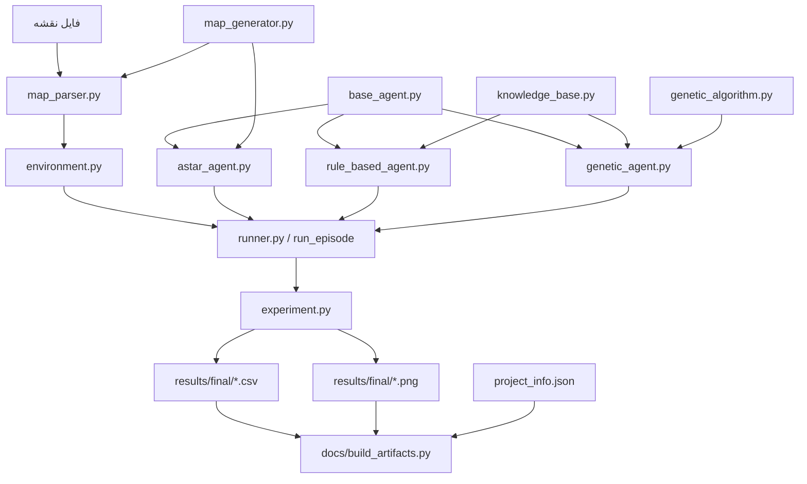
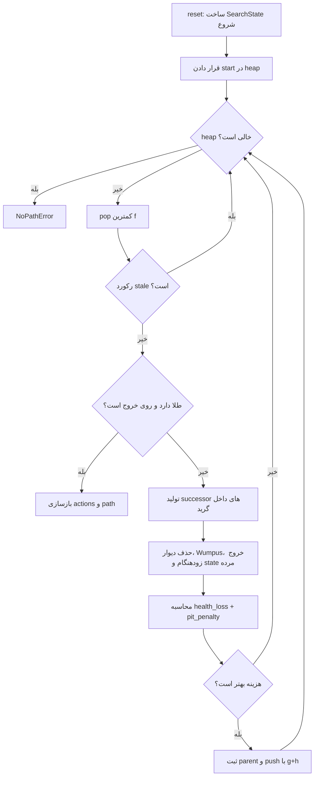
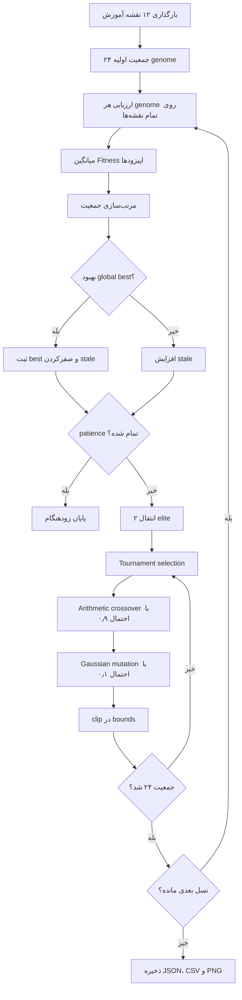

# گزارش کار فنی جامع پروژه Wumpus World – Version 8

> **ریپازیتوری:** `https://github.com/mahan-vzmz/Wumpus-World-Genetic`  
> **commit بررسی‌شده:** `07348f15251e939a1c8255150d2077a96b904784` با پیام `Update project to latest version`  
> **نسخه نرم‌افزار:** `8.1.0`  
> **زبان پیاده‌سازی:** Python 3.10+  
> **تاریخ تهیه گزارش:** ۱۴۰۵/۰۵/۰۸  
> **مبنای گزارش:** سورس واقعی ریپو، `FILE_MANIFEST.sha256`، خروجی اجرای واقعی تست‌ها، نقشه‌ها، JSONها، CSVها و مستندات پوشه `docs`

این گزارش یک بررسی فنی یکپارچه و فایل‌به‌فایل از نسخه نهایی پروژه است. برای جلوگیری از ورود اطلاعات حدسی، تمام عددها از فایل‌های واقعی ریپو استخراج شده‌اند. قطعه‌کدهای نقل‌شده نیز بدون بازنویسی از سورس اصلی کپی شده‌اند. کنترل `sha256sum -c FILE_MANIFEST.sha256` برای هر ۱۲۱ ورودی manifest نتیجه `OK` داده است.

## فهرست مطالب

1. [معرفی و مرور کلی پروژه](#section-1)
2. [ساختار پروژه و درخت فایل‌ها](#section-2)
3. [توضیح کامل فایل‌های کد](#section-3)
4. [توضیح عمیق الگوریتم‌ها](#section-4)
5. [محیط شبیه‌سازی و قوانین بازی](#section-5)
6. [داده‌های آموزش و نقشه‌ها](#section-6)
7. [جدول‌های کامل نتایج آزمایش](#section-7)
8. [تست‌ها و Trace اجرای آن‌ها](#section-8)
9. [نمونه اجراهای واقعی](#section-9)
10. [فایل‌های پیکربندی و تحویل](#section-10)
11. [محدودیت‌ها و نکات علمی](#section-11)
12. [نتیجه‌گیری نهایی و پیشنهادهای آینده](#section-12)
13. [ضمیمه: نحوه اجرای کامل پروژه](#section-13)

<a id="section-1"></a>

# ۱. معرفی و مرور کلی پروژه

## ۱.۱ مسئله Wumpus World در این پروژه

Wumpus World یک محیط شبکه‌ای برای بررسی تصمیم‌گیری عامل هوشمند در شرایط اطلاعات ناقص است. نسخه حاضر روی گرید ثابت `8×8` اجرا می‌شود. عامل از خانه `(1,1)` آغاز می‌کند، باید حداقل یک طلا را جمع‌آوری کند و سپس پیش از تمام‌شدن جان به خروج برسد.

عناصر نقشه عبارت‌اند از:

- `*`: خانه خالی و قابل‌عبور؛
- `D`: دیوار؛
- `P`: چاه؛
- `W`: غول یا Wumpus؛
- `G`: طلا؛
- خروج: در خط دوازدهم فایل نقشه تعیین می‌شود و داخل گرید با نماد جداگانه ذخیره نمی‌شود.

این پیاده‌سازی یک نسخه سفارشی از مسئله کلاسیک است. جهت عامل، چرخش، تیر، اکشن `Shoot` و امکان کشتن Wumpus در مدل وجود ندارند. حرکت فقط در چهار جهت اصلی انجام می‌شود.

## ۱.۲ هدف مقایسه سه روش

سه روش از سه سطح اطلاعات و سبک تصمیم‌گیری متفاوت استفاده می‌کنند:

1. **A-Star آگاه از کل نقشه:** محل دیوار، چاه، Wumpus، طلا و خروج را می‌داند؛ بنابراین Oracle یا کران بالای عملکرد است.
2. **Rule-Based آنلاین:** نقشه مخفی را نمی‌خواند و از `Breeze`، `Stench`، `pit_here`، حرکت‌های معتبر و حافظه داخلی برای استنتاج استفاده می‌کند.
3. **Hybrid Genetic آنلاین:** همان پایگاه دانش محلی را دارد، اما در مرحله اکتشاف حرکت‌ها را با یک تابع خطی و ده وزن تکامل‌یافته امتیازدهی می‌کند. پس از طلا، از مسیر امن deterministic استفاده می‌کند.

هدف علمی، نشان دادن مبادله میان **اطلاعات کامل، توضیح‌پذیری، نرخ موفقیت، ریسک و کوتاهی مسیر** است. مقایسه مستقیم A-Star با دو عامل آنلاین کاملاً منصفانه نیست؛ مقایسه اصلی باید میان Rule-Based و Hybrid Genetic انجام شود.

## ۱.۳ وضعیت نهایی نسخه تحویلی

| شاخص | مقدار واقعی |
|---|---:|
| نسخه | `8.1.0` |
| تست‌های پاس‌شده | `44 passed` |
| فایل نقشه معتبر | 46 |
| نقشه آموزش GA | 12 |
| نقشه آزمون نهایی | 30 |
| اپیزود benchmark | 90 |
| خطای ثبت‌شده در benchmark | 0 |
| seed خود الگوریتم ژنتیک | `17` |
| seed تولید مجموعه آموزش | `1701` |
| seed تولید مجموعه آزمون | `20260730` |
| جمعیت GA | 24 |
| حداکثر نسل | 24 |
| `best_fitness` نهایی | `1840.6666666666667` |

نکته مهم درباره seedها: عبارت «seed آموزش = 17» در README به RNG الگوریتم ژنتیک اشاره دارد. خود نقشه‌های آموزش با seed پیش‌فرض `1701` ساخته می‌شوند. این دو نقش متفاوت دارند.

## ۱.۴ خلاصه نتیجه آزمایش نهایی

| روش | نرخ موفقیت | امتیاز متوسط همه اجراها | حرکت متوسط همه اجراها | حرکت متوسط اجراهای موفق |
|---|---:|---:|---:|---:|
| A-Star | 100.00% | 157.60 | 12.40 | 12.40 |
| Rule-Based | 90.00% | 117.93 | 32.90 | 32.30 |
| Hybrid Genetic | 83.33% | 120.97 | 31.80 | 24.60 |

A-Star به علت مشاهده کامل نقشه روی هر ۳۰ نقشه موفق شده است. در میان دو عامل آنلاین، Rule-Based نرخ موفقیت بیشتری دارد. Hybrid Genetic در اپیزودهای موفق به‌طور متوسط ۷٫۷ حرکت کمتر از Rule-Based مصرف کرده، ولی مرگ با Wumpus بیشتری داشته است.

### خلاصه بخش

| محور | نتیجه |
|---|---|
| هدف پروژه | مقایسه Oracle آگاه از نقشه با دو عامل آنلاین روی قرارداد محیط مشترک |
| وضعیت فنی | ۴۴ تست پاس، ۴۶ نقشه معتبر، ۹۰ اپیزود بدون error |
| نتیجه اصلی | Rule-Based مطمئن‌تر؛ Hybrid Genetic کوتاه‌مسیرتر در موفقیت‌ها؛ A-Star کران بالا |

<a id="section-2"></a>

# ۲. ساختار پروژه و درخت فایل‌ها

## ۲.۱ درخت کامل نسخه بررسی‌شده

```text
wumpus-world-8
├── .github
│   └── workflows
│       └── tests.yml
├── docs
│   ├── assets
│   │   ├── average_score.png
│   │   ├── average_steps_success.png
│   │   ├── failure_reasons.png
│   │   ├── genetic_fitness.png
│   │   ├── remaining_health.png
│   │   ├── runtime.png
│   │   ├── success_by_difficulty.png
│   │   └── success_rate.png
│   ├── final_report
│   │   ├── final_report.html
│   │   ├── final_report.md
│   │   └── final_report.pdf
│   ├── PDF
│   │   ├── 
│   │   ├── 
│   │   └── 
│   ├── 01-problem-and-assumptions.md
│   ├── 02-architecture.md
│   ├── 03-methods.md
│   ├── 04-experiment-design.md
│   ├── 05-results-and-analysis.md
│   ├── 06-run-guide.md
│   ├── 07-delivery-checklist.md
│   ├── build_artifacts.py
│   └── README.md
├── maps
│   ├── test
│   │   ├── manifest.json
│   │   ├── test_001_easy.txt
│   │   ├── test_002_easy.txt
│   │   ├── test_003_easy.txt
│   │   ├── test_004_easy.txt
│   │   ├── test_005_easy.txt
│   │   ├── test_006_easy.txt
│   │   ├── test_007_easy.txt
│   │   ├── test_008_easy.txt
│   │   ├── test_009_easy.txt
│   │   ├── test_010_easy.txt
│   │   ├── test_011_medium.txt
│   │   ├── test_012_medium.txt
│   │   ├── test_013_medium.txt
│   │   ├── test_014_medium.txt
│   │   ├── test_015_medium.txt
│   │   ├── test_016_medium.txt
│   │   ├── test_017_medium.txt
│   │   ├── test_018_medium.txt
│   │   ├── test_019_medium.txt
│   │   ├── test_020_medium.txt
│   │   ├── test_021_hard.txt
│   │   ├── test_022_hard.txt
│   │   ├── test_023_hard.txt
│   │   ├── test_024_hard.txt
│   │   ├── test_025_hard.txt
│   │   ├── test_026_hard.txt
│   │   ├── test_027_hard.txt
│   │   ├── test_028_hard.txt
│   │   ├── test_029_hard.txt
│   │   └── test_030_hard.txt
│   ├── training
│   │   ├── manifest.json
│   │   ├── training_001_easy.txt
│   │   ├── training_002_easy.txt
│   │   ├── training_003_easy.txt
│   │   ├── training_004_easy.txt
│   │   ├── training_005_medium.txt
│   │   ├── training_006_medium.txt
│   │   ├── training_007_medium.txt
│   │   ├── training_008_medium.txt
│   │   ├── training_009_hard.txt
│   │   ├── training_010_hard.txt
│   │   ├── training_011_hard.txt
│   │   └── training_012_hard.txt
│   ├── sample_01.txt
│   ├── sample_astar_pit.txt
│   ├── sample_rule_reasoning.txt
│   └── sample_rule_safe.txt
├── results
│   ├── final
│   │   ├── average_score.png
│   │   ├── average_steps_success.png
│   │   ├── difficulty_results.csv
│   │   ├── experiment_results.csv
│   │   ├── experiment_summary.txt
│   │   ├── failure_reasons.png
│   │   ├── remaining_health.png
│   │   ├── runtime.png
│   │   ├── success_by_difficulty.png
│   │   ├── success_rate.png
│   │   └── summary_results.csv
│   ├── default_vs_evolved.txt
│   ├── genetic_fitness.png
│   ├── genetic_history.csv
│   └── genetic_training_summary.json
├── tests
│   ├── test_astar_agent.py
│   ├── test_environment.py
│   ├── test_experiment.py
│   ├── test_genetic_agent.py
│   ├── test_map_generator.py
│   ├── test_map_parser.py
│   └── test_rule_based_agent.py
├── .gitignore
├── astar_agent.py
├── base_agent.py
├── best_weights.json
├── CHANGELOG.md
├── compare_genetic_weights.py
├── DELIVERY_CHECKLIST_FA.md
├── demo.py
├── environment.py
├── experiment.py
├── FILE_MANIFEST.sha256
├── genetic_agent.py
├── genetic_algorithm.py
├── knowledge_base.py
├── LICENSE
├── runner.py
├── map_generator.py
├── map_parser.py
├── PROJECT_AUDIT.md
├── project_info.json
├── pyproject.toml
├── random_agent.py
├── README.md
├── requirements-docs.txt
├── requirements.txt
├── rule_based_agent.py
├── train_genetic.py
└── verify_delivery.py
```

## ۲.۲ معماری وابستگی ماژول‌ها



## ۲.۳ جدول مسئولیت تمام فایل‌ها

تعداد خط برای فایل‌های متنی از محتوای واقعی محاسبه شده است. برای PDF، PNG و PPTX مقدار `binary` درج شده است.

#### فایل‌های ریشه و CI

| نام فایل | مسئولیت/نقش | وابستگی به فایل‌های دیگر | تعداد خط تقریبی |
|---|---|---|---:|
| `.github/workflows/tests.yml` | اجرای CI برای Python 3.10 تا 3.13؛ pytest و compileall | requirements.txt، tests/، همه فایل‌های Python | 22 |
| `.gitignore` | حذف محیط مجازی، cache، تنظیمات IDE و فایل‌های سیستم‌عامل از Git | — | 22 |
| `CHANGELOG.md` | ثبت تغییرات نسخه 8.1.0 | — | 14 |
| `DELIVERY_CHECKLIST_FA.md` | چک‌لیست فارسی پیش از تحویل | — | 37 |
| `FILE_MANIFEST.sha256` | هش SHA-256 فایل‌های بسته تحویل برای کنترل یکپارچگی | تمام فایل‌های تحویل به‌جز خود manifest | 121 |
| `LICENSE` | متن MIT License | — | 21 |
| `PROJECT_AUDIT.md` | نتیجه ممیزی فنی نهایی پروژه | — | 40 |
| `README.md` | راهنمای اصلی پروژه، نتایج، اجرا و محدودیت‌ها | — | 167 |
| `astar_agent.py` | عامل A* آگاه از نقشه و برنامه‌ریزی risk-aware | base_agent, environment, map_parser | 200 |
| `base_agent.py` | رابط انتزاعی مشترک عامل‌ها | environment | 16 |
| `best_weights.json` | وزن‌های تکامل‌یافته و metadata آموزش GA | genetic_agent.py، train_genetic.py، runner.py | 21 |
| `compare_genetic_weights.py` | مقایسه وزن‌های دستی و تکامل‌یافته روی نقشه‌های آموزش | genetic_agent, genetic_algorithm, map_parser | 41 |
| `demo.py` | اجرای خلاصه هر سه عامل روی یک نقشه | main | 32 |
| `environment.py` | محیط قطعی بازی، state، perception، score و termination | map_parser | 232 |
| `experiment.py` | اجرای benchmark، تجمیع، CSV و نمودارها | main, map_generator | 414 |
| `genetic_agent.py` | عامل ژنتیکی ترکیبی، ویژگی‌ها و سیاست وزن‌دار | base_agent, environment, knowledge_base, map_parser | 355 |
| `genetic_algorithm.py` | آموزش GA، Fitness و ذخیره خروجی‌ها | environment, genetic_agent, map_parser | 378 |
| `knowledge_base.py` | پایگاه دانش ادراکی و استنتاج خطر/امنیت | environment | 234 |
| `runner.py` | ساخت عامل و حلقه اجرای استاندارد اپیزود | astar_agent, base_agent, environment, genetic_agent, map_parser, random_agent, rule_based_agent | 214 |
| `map_generator.py` | تولید قطعی نقشه‌های آموزش و آزمون | astar_agent, map_parser | 314 |
| `map_parser.py` | خواندن و اعتبارسنجی سخت‌گیرانه نقشه | کتابخانه استاندارد/وابستگی خارجی | 99 |
| `project_info.json` | اطلاعات صفحه عنوان گزارش و ارائه | docs/build_artifacts.py | 8 |
| `pyproject.toml` | metadata بسته و تنظیمات pytest | pytest | 10 |
| `random_agent.py` | baseline تصادفی با seed ثابت برای کنترل محیط | base_agent, environment | 24 |
| `requirements-docs.txt` | وابستگی‌های ساخت PDF و PPTX | pip؛ کد/تست یا docs/build_artifacts.py | 3 |
| `requirements.txt` | وابستگی‌های اجرای کد و تست | pip؛ کد/تست یا docs/build_artifacts.py | 2 |
| `rule_based_agent.py` | عامل قاعده‌محور، frontier و backtracking امن | base_agent, environment, knowledge_base, map_parser | 287 |
| `train_genetic.py` | CLI آموزش و بازتولید artifacts ژنتیکی | genetic_algorithm, map_generator | 71 |
| `verify_delivery.py` | اعتبارسنجی تعداد نقشه‌ها، نتایج و artifacts تحویل | genetic_agent, main, map_parser | 77 |

#### مستندات و artifacts

| نام فایل | مسئولیت/نقش | وابستگی به فایل‌های دیگر | تعداد خط تقریبی |
|---|---|---|---:|
| `docs/01-problem-and-assumptions.md` | مستند فنی: 01 problem and assumptions | README.md، کدها و results/final/*.csv | 40 |
| `docs/02-architecture.md` | مستند فنی: 02 architecture | README.md، کدها و results/final/*.csv | 34 |
| `docs/03-methods.md` | مستند فنی: 03 methods | README.md، کدها و results/final/*.csv | 73 |
| `docs/04-experiment-design.md` | مستند فنی: 04 experiment design | README.md، کدها و results/final/*.csv | 44 |
| `docs/05-results-and-analysis.md` | مستند فنی: 05 results and analysis | README.md، کدها و results/final/*.csv | 49 |
| `docs/06-run-guide.md` | مستند فنی: 06 run guide | README.md، کدها و results/final/*.csv | 74 |
| `docs/07-delivery-checklist.md` | مستند فنی: 07 delivery checklist | README.md، کدها و results/final/*.csv | 13 |
| `docs/README.md` | فهرست مستندات نسخه 8 | README.md، کدها و results/final/*.csv | 20 |
| `docs/assets/average_score.png` | نمودار تصویری استفاده‌شده در مستندات | کپی از results توسط docs/build_artifacts.py؛ مصرف در گزارش/اسلاید | binary |
| `docs/assets/average_steps_success.png` | نمودار تصویری استفاده‌شده در مستندات | کپی از results توسط docs/build_artifacts.py؛ مصرف در گزارش/اسلاید | binary |
| `docs/assets/failure_reasons.png` | نمودار تصویری استفاده‌شده در مستندات | کپی از results توسط docs/build_artifacts.py؛ مصرف در گزارش/اسلاید | binary |
| `docs/assets/genetic_fitness.png` | نمودار تصویری استفاده‌شده در مستندات | کپی از results توسط docs/build_artifacts.py؛ مصرف در گزارش/اسلاید | binary |
| `docs/assets/remaining_health.png` | نمودار تصویری استفاده‌شده در مستندات | کپی از results توسط docs/build_artifacts.py؛ مصرف در گزارش/اسلاید | binary |
| `docs/assets/runtime.png` | نمودار تصویری استفاده‌شده در مستندات | کپی از results توسط docs/build_artifacts.py؛ مصرف در گزارش/اسلاید | binary |
| `docs/assets/success_by_difficulty.png` | نمودار تصویری استفاده‌شده در مستندات | کپی از results توسط docs/build_artifacts.py؛ مصرف در گزارش/اسلاید | binary |
| `docs/assets/success_rate.png` | نمودار تصویری استفاده‌شده در مستندات | کپی از results توسط docs/build_artifacts.py؛ مصرف در گزارش/اسلاید | binary |
| `docs/build_artifacts.py` | ساخت گزارش PDF و ارائه PPTX/PDF از داده‌های پروژه | کتابخانه استاندارد/وابستگی خارجی | 305 |
| `docs/final_report/final_report.html` | نسخه HTML گزارش نهایی | تولید: docs/build_artifacts.py؛ وابسته به project_info.json و results | 88 |
| `docs/final_report/final_report.md` | مستند فنی: final_report | تولید: docs/build_artifacts.py؛ وابسته به project_info.json و results | 74 |
| `docs/final_report/final_report.pdf` | گزارش نهایی PDF | تولید: docs/build_artifacts.py؛ وابسته به project_info.json و results | binary |
| `docs/PDF/` | مستند فنی: PDF_notes | تولید: docs/build_artifacts.py؛ وابسته به project_info.json و results | 59 |
| `docs/PDF/` | PDF ارائه نهایی | تولید: docs/build_artifacts.py؛ وابسته به project_info.json و results | binary |
| `docs/PDF/` | فایل ارائه نهایی PowerPoint | تولید: docs/build_artifacts.py؛ وابسته به project_info.json و results | binary |

#### نقشه‌ها

| نام فایل | مسئولیت/نقش | وابستگی به فایل‌های دیگر | تعداد خط تقریبی |
|---|---|---|---:|
| `maps/sample_01.txt` | نقشه نمونه برای اجرا/ارائه/تست | map_parser.py، runner.py، demo.py، تست‌ها | 12 |
| `maps/sample_astar_pit.txt` | نقشه نمونه برای اجرا/ارائه/تست | map_parser.py، runner.py، demo.py، تست‌ها | 12 |
| `maps/sample_rule_reasoning.txt` | نقشه نمونه برای اجرا/ارائه/تست | map_parser.py، runner.py، demo.py، تست‌ها | 12 |
| `maps/sample_rule_safe.txt` | نقشه نمونه برای اجرا/ارائه/تست | map_parser.py، runner.py، demo.py، تست‌ها | 12 |
| `maps/test/manifest.json` | metadata سی نقشه آزمون نهایی | map_generator.py، map_parser.py، experiment.py | 632 |
| `maps/test/test_001_easy.txt` | نقشه آزمون دیده‌نشده برای benchmark | map_generator.py، map_parser.py، experiment.py | 12 |
| `maps/test/test_002_easy.txt` | نقشه آزمون دیده‌نشده برای benchmark | map_generator.py، map_parser.py، experiment.py | 12 |
| `maps/test/test_003_easy.txt` | نقشه آزمون دیده‌نشده برای benchmark | map_generator.py، map_parser.py، experiment.py | 12 |
| `maps/test/test_004_easy.txt` | نقشه آزمون دیده‌نشده برای benchmark | map_generator.py، map_parser.py، experiment.py | 12 |
| `maps/test/test_005_easy.txt` | نقشه آزمون دیده‌نشده برای benchmark | map_generator.py، map_parser.py، experiment.py | 12 |
| `maps/test/test_006_easy.txt` | نقشه آزمون دیده‌نشده برای benchmark | map_generator.py، map_parser.py، experiment.py | 12 |
| `maps/test/test_007_easy.txt` | نقشه آزمون دیده‌نشده برای benchmark | map_generator.py، map_parser.py، experiment.py | 12 |
| `maps/test/test_008_easy.txt` | نقشه آزمون دیده‌نشده برای benchmark | map_generator.py، map_parser.py، experiment.py | 12 |
| `maps/test/test_009_easy.txt` | نقشه آزمون دیده‌نشده برای benchmark | map_generator.py، map_parser.py، experiment.py | 12 |
| `maps/test/test_010_easy.txt` | نقشه آزمون دیده‌نشده برای benchmark | map_generator.py، map_parser.py، experiment.py | 12 |
| `maps/test/test_011_medium.txt` | نقشه آزمون دیده‌نشده برای benchmark | map_generator.py، map_parser.py، experiment.py | 12 |
| `maps/test/test_012_medium.txt` | نقشه آزمون دیده‌نشده برای benchmark | map_generator.py، map_parser.py، experiment.py | 12 |
| `maps/test/test_013_medium.txt` | نقشه آزمون دیده‌نشده برای benchmark | map_generator.py، map_parser.py، experiment.py | 12 |
| `maps/test/test_014_medium.txt` | نقشه آزمون دیده‌نشده برای benchmark | map_generator.py، map_parser.py، experiment.py | 12 |
| `maps/test/test_015_medium.txt` | نقشه آزمون دیده‌نشده برای benchmark | map_generator.py، map_parser.py، experiment.py | 12 |
| `maps/test/test_016_medium.txt` | نقشه آزمون دیده‌نشده برای benchmark | map_generator.py، map_parser.py، experiment.py | 12 |
| `maps/test/test_017_medium.txt` | نقشه آزمون دیده‌نشده برای benchmark | map_generator.py، map_parser.py، experiment.py | 12 |
| `maps/test/test_018_medium.txt` | نقشه آزمون دیده‌نشده برای benchmark | map_generator.py، map_parser.py، experiment.py | 12 |
| `maps/test/test_019_medium.txt` | نقشه آزمون دیده‌نشده برای benchmark | map_generator.py، map_parser.py، experiment.py | 12 |
| `maps/test/test_020_medium.txt` | نقشه آزمون دیده‌نشده برای benchmark | map_generator.py، map_parser.py، experiment.py | 12 |
| `maps/test/test_021_hard.txt` | نقشه آزمون دیده‌نشده برای benchmark | map_generator.py، map_parser.py، experiment.py | 12 |
| `maps/test/test_022_hard.txt` | نقشه آزمون دیده‌نشده برای benchmark | map_generator.py، map_parser.py، experiment.py | 12 |
| `maps/test/test_023_hard.txt` | نقشه آزمون دیده‌نشده برای benchmark | map_generator.py، map_parser.py، experiment.py | 12 |
| `maps/test/test_024_hard.txt` | نقشه آزمون دیده‌نشده برای benchmark | map_generator.py، map_parser.py، experiment.py | 12 |
| `maps/test/test_025_hard.txt` | نقشه آزمون دیده‌نشده برای benchmark | map_generator.py، map_parser.py، experiment.py | 12 |
| `maps/test/test_026_hard.txt` | نقشه آزمون دیده‌نشده برای benchmark | map_generator.py، map_parser.py، experiment.py | 12 |
| `maps/test/test_027_hard.txt` | نقشه آزمون دیده‌نشده برای benchmark | map_generator.py، map_parser.py، experiment.py | 12 |
| `maps/test/test_028_hard.txt` | نقشه آزمون دیده‌نشده برای benchmark | map_generator.py، map_parser.py، experiment.py | 12 |
| `maps/test/test_029_hard.txt` | نقشه آزمون دیده‌نشده برای benchmark | map_generator.py، map_parser.py، experiment.py | 12 |
| `maps/test/test_030_hard.txt` | نقشه آزمون دیده‌نشده برای benchmark | map_generator.py، map_parser.py، experiment.py | 12 |
| `maps/training/manifest.json` | metadata دوازده نقشه آموزش GA | map_generator.py، map_parser.py، train_genetic.py | 254 |
| `maps/training/training_001_easy.txt` | نقشه آموزش سیاست ژنتیکی | map_generator.py، map_parser.py، train_genetic.py | 12 |
| `maps/training/training_002_easy.txt` | نقشه آموزش سیاست ژنتیکی | map_generator.py، map_parser.py، train_genetic.py | 12 |
| `maps/training/training_003_easy.txt` | نقشه آموزش سیاست ژنتیکی | map_generator.py، map_parser.py، train_genetic.py | 12 |
| `maps/training/training_004_easy.txt` | نقشه آموزش سیاست ژنتیکی | map_generator.py، map_parser.py، train_genetic.py | 12 |
| `maps/training/training_005_medium.txt` | نقشه آموزش سیاست ژنتیکی | map_generator.py، map_parser.py، train_genetic.py | 12 |
| `maps/training/training_006_medium.txt` | نقشه آموزش سیاست ژنتیکی | map_generator.py، map_parser.py، train_genetic.py | 12 |
| `maps/training/training_007_medium.txt` | نقشه آموزش سیاست ژنتیکی | map_generator.py، map_parser.py، train_genetic.py | 12 |
| `maps/training/training_008_medium.txt` | نقشه آموزش سیاست ژنتیکی | map_generator.py، map_parser.py، train_genetic.py | 12 |
| `maps/training/training_009_hard.txt` | نقشه آموزش سیاست ژنتیکی | map_generator.py، map_parser.py، train_genetic.py | 12 |
| `maps/training/training_010_hard.txt` | نقشه آموزش سیاست ژنتیکی | map_generator.py، map_parser.py، train_genetic.py | 12 |
| `maps/training/training_011_hard.txt` | نقشه آموزش سیاست ژنتیکی | map_generator.py، map_parser.py، train_genetic.py | 12 |
| `maps/training/training_012_hard.txt` | نقشه آموزش سیاست ژنتیکی | map_generator.py، map_parser.py، train_genetic.py | 12 |

#### نتایج

| نام فایل | مسئولیت/نقش | وابستگی به فایل‌های دیگر | تعداد خط تقریبی |
|---|---|---|---:|
| `results/default_vs_evolved.txt` | خروجی مقایسه وزن دستی و تکامل‌یافته | تولید: train_genetic.py یا compare_genetic_weights.py؛ مصرف: docs/build_artifacts.py/README | 32 |
| `results/final/average_score.png` | نمودار خروجی benchmark | تولید: experiment.py؛ مصرف: docs/build_artifacts.py | binary |
| `results/final/average_steps_success.png` | نمودار خروجی benchmark | تولید: experiment.py؛ مصرف: docs/build_artifacts.py | binary |
| `results/final/difficulty_results.csv` | نتایج تفکیک‌شده بر اساس سختی | تولید: experiment.py؛ مصرف: README/docs/build_artifacts.py | 10 |
| `results/final/experiment_results.csv` | داده خام ۹۰ اپیزود benchmark | تولید: experiment.py؛ مصرف: README/docs/build_artifacts.py | 91 |
| `results/final/experiment_summary.txt` | تفسیر متنی خودکار نتایج نهایی | تولید: experiment.py؛ مصرف: README/docs/build_artifacts.py | 28 |
| `results/final/failure_reasons.png` | نمودار خروجی benchmark | تولید: experiment.py؛ مصرف: docs/build_artifacts.py | binary |
| `results/final/remaining_health.png` | نمودار خروجی benchmark | تولید: experiment.py؛ مصرف: docs/build_artifacts.py | binary |
| `results/final/runtime.png` | نمودار خروجی benchmark | تولید: experiment.py؛ مصرف: docs/build_artifacts.py | binary |
| `results/final/success_by_difficulty.png` | نمودار خروجی benchmark | تولید: experiment.py؛ مصرف: docs/build_artifacts.py | binary |
| `results/final/success_rate.png` | نمودار خروجی benchmark | تولید: experiment.py؛ مصرف: docs/build_artifacts.py | binary |
| `results/final/summary_results.csv` | خلاصه کلی نتایج سه عامل | تولید: experiment.py؛ مصرف: README/docs/build_artifacts.py | 4 |
| `results/genetic_fitness.png` | نمودار روند Fitness آموزش | تولید: train_genetic.py یا compare_genetic_weights.py؛ مصرف: docs/build_artifacts.py/README | binary |
| `results/genetic_history.csv` | تاریخچه ۲۴ نسل آموزش GA | تولید: train_genetic.py یا compare_genetic_weights.py؛ مصرف: docs/build_artifacts.py/README | 25 |
| `results/genetic_training_summary.json` | خلاصه و وزن‌های بهترین آموزش | تولید: train_genetic.py یا compare_genetic_weights.py؛ مصرف: docs/build_artifacts.py/README | 18 |

#### تست‌ها

| نام فایل | مسئولیت/نقش | وابستگی به فایل‌های دیگر | تعداد خط تقریبی |
|---|---|---|---:|
| `tests/test_astar_agent.py` | تست خودکار astar agent | astar_agent, environment, map_parser | 123 |
| `tests/test_environment.py` | تست خودکار environment | environment, map_parser | 139 |
| `tests/test_experiment.py` | تست خودکار experiment | experiment, main, map_generator | 47 |
| `tests/test_genetic_agent.py` | تست خودکار genetic agent | environment, genetic_agent, genetic_algorithm, map_parser | 82 |
| `tests/test_map_generator.py` | تست خودکار map generator | astar_agent, map_generator, map_parser | 43 |
| `tests/test_map_parser.py` | تست خودکار map parser | map_parser | 59 |
| `tests/test_rule_based_agent.py` | تست خودکار rule based agent | environment, knowledge_base, map_parser, rule_based_agent | 109 |

### خلاصه بخش

| محور | نتیجه |
|---|---|
| تعداد فایل‌ها | ۱۲۲ فایل در آرشیو؛ ۱۲۱ فایل در FILE_MANIFEST به‌جز خود manifest |
| هسته معماری | parser → environment → agent → run_episode → experiment → artifacts |
| اصل طراحی | محیط و قرارداد observation برای هر سه روش مشترک است |

<a id="section-3"></a>

# ۳. توضیح کامل هر فایل کد

در این بخش تمام فایل‌های Python تولیدی پروژه بررسی می‌شوند. فایل‌های تست در بخش ۸ به‌صورت تست‌به‌تست پوشش داده شده‌اند.

## ۳.۱ `environment.py` — محیط قطعی بازی

**هدف یک‌خطی:** نگهداری وضعیت اپیزود، تولید observation، اعمال اکشن، محاسبه امتیاز و تعیین علت پایان.

### ساختارها و متدهای مهم

| عضو | ورودی | خروجی/اثر |
|---|---|---|
| `Action` | رشته `UP/DOWN/LEFT/RIGHT` | Enum اکشن‌ها |
| `GameState` | مقدارهای اولیه state | موقعیت، جان، طلا، چاه، گام، امتیاز، تاریخچه و پایان |
| `reset()` | ندارد | بازسازی طلاها و state و برگرداندن observation اولیه |
| `observe()` | state فعلی | دیکشنری ادراک محلی |
| `valid_actions()` | موقعیت فعلی | حرکت‌های داخل گرید و غیر دیوار |
| `step(action)` | اکشن | `(observation, reward, done, info)` |
| `terminate(reason)` | علت پایان | پایان ناموفق صریح مانند `max_steps` |
| `render()` | state | نمایش متنی گرید |

Observation واقعی شامل `position`، `health`، `breeze`، `stench`، `pit_here`، `gold_here`، `has_gold`، `at_exit`، `valid_actions` و `visited` است.

### قطعه‌کد شاخص: observation و score

```python
def observe(self) -> dict[str, Any]:
    position = self.state.position
    nearby_cells = [self.cell_at(p) for p in self.neighbors(position)]
    current_cell = self.cell_at(position)
    return {
        "position": position,
        "position_one_based": (position[0] + 1, position[1] + 1),
        "health": self.state.health,
        "breeze": "P" in nearby_cells,
        "stench": "W" in nearby_cells,
        "pit_here": current_cell == "P",
        "gold_here": position in self.remaining_gold,
        "has_gold": self.state.collected_gold > 0,
        "at_exit": position == self.config.exit_position,
        "valid_actions": [action.value for action in self.valid_actions()],
        "visited": set(self.state.visited),
    }


def _calculate_score(self) -> int:
    return (
        self.state.health
        + self.state.collected_gold * self.config.gold_score
        - self.state.pit_entries * self.config.pit_penalty
    )
```

امتیاز یک مقدار تجمعی مستقل نیست؛ در هر لحظه دوباره از فرمول زیر محاسبه می‌شود:

```text
score = health + collected_gold * gold_score - pit_entries * pit_penalty
```

`reward` هر حرکت برابر اختلاف امتیاز جدید و قبلی است.

### قطعه‌کد شاخص: اعمال اکشن

```python
def step(self, action: Action | str) -> tuple[dict[str, Any], int, bool, dict[str, Any]]:
    if self.state.done:
        raise RuntimeError("Episode is finished. Call reset() before taking another action.")

    try:
        action = Action(action)
    except ValueError as exc:
        raise ValueError(f"Unknown action: {action!r}") from exc

    old_score = self.state.score
    old_position = self.state.position
    dr, dc = ACTION_DELTAS[action]
    candidate = (old_position[0] + dr, old_position[1] + dc)
    blocked = not self._inside(candidate) or (self._inside(candidate) and self.cell_at(candidate) == "D")

    # Every attempted move, including blocked moves, costs one health point.
    self.state.health -= 1
    self.state.steps += 1

    if not blocked:
        self.state.position = candidate
        self.state.visited.add(candidate)
        cell = self.cell_at(candidate)

        if cell == "W":
            self.state.health = 0
            self.state.done = True
            self.state.success = False
            self.state.termination_reason = "wumpus"
        elif cell == "P":
            self.state.pit_entries += 1
            self.state.health //= 2

        if candidate in self.remaining_gold and not self.state.done:
            self.remaining_gold.remove(candidate)
            self.state.collected_gold += 1

        if candidate == self.config.exit_position and not self.state.done:
            self.state.done = True
            self.state.success = self.state.collected_gold > 0
            self.state.termination_reason = "escaped_with_gold" if self.state.success else "escaped_without_gold"

    if self.state.health <= 0 and not self.state.done:
        self.state.health = 0
        self.state.done = True
        self.state.success = False
        self.state.termination_reason = "health_depleted"

    self.state.score = self._calculate_score()
    reward = self.state.score - old_score
```

**ارتباط ماژولی:** `environment.py` از `MapConfig` استفاده می‌کند و توسط `runner.py`، عامل‌ها، GA و تست‌ها فراخوانی می‌شود.

## ۳.۲ `base_agent.py` — قرارداد مشترک عامل‌ها

**هدف یک‌خطی:** تعریف رابط اجباری `reset()` و `choose_action()` برای تمام عامل‌ها.

```python
from __future__ import annotations

from abc import ABC, abstractmethod
from typing import Any

from environment import Action


class BaseAgent(ABC):
    @abstractmethod
    def reset(self) -> None:
        """Reset agent memory before a new episode."""

    @abstractmethod
    def choose_action(self, observation: dict[str, Any]) -> Action:
        raise NotImplementedError
```

کلاس‌های `AStarAgent`، `RuleBasedAgent`، `GeneticAgent` و `RandomAgent` از این رابط پیروی می‌کنند. این قرارداد باعث می‌شود `run_episode()` بدون وابستگی به منطق داخلی عامل، حلقه اجرا را مدیریت کند.

## ۳.۳ `astar_agent.py` — عامل A-Star آگاه از نقشه

**هدف یک‌خطی:** پیدا کردن مسیر زنده‌ماندنی با کمترین هزینه از شروع به طلا و سپس خروج.

### مدل حالت واقعی

```python
@dataclass(frozen=True)
class SearchState:
    position: tuple[int, int]
    health: int
    has_gold: bool


@dataclass(frozen=True)
class PlanResult:
    actions: tuple[Action, ...]
    path: tuple[tuple[int, int], ...]
    total_cost: int
    final_health: int
    expanded_nodes: int
```

برخلاف بعضی نسخه‌های کلاسیک Wumpus World، در این کد جهت عامل، تعداد تیر یا وضعیت زنده‌بودن Wumpus جزو state نیست. Wumpus همواره یک خانه غیرقابل‌عبور محسوب می‌شود.

### حلقه جست‌وجو

```python
        start_state = SearchState(start, initial_health, has_gold)
        frontier: list[tuple[int, int, int, SearchState]] = []
        tie_breaker = count()
        heappush(frontier, (self._heuristic(start_state), 0, next(tie_breaker), start_state))
        best_cost: dict[SearchState, int] = {start_state: 0}
        came_from: dict[SearchState, tuple[SearchState, Action]] = {}
        expanded_nodes = 0

        while frontier:
            _, current_cost, _, current = heappop(frontier)
            if current_cost != best_cost.get(current):
                continue

            expanded_nodes += 1
            if current.has_gold and current.position == self.config.exit_position:
                actions, path = self._reconstruct(came_from, current)
                return PlanResult(
                    actions=actions,
                    path=path,
                    total_cost=current_cost,
                    final_health=current.health,
                    expanded_nodes=expanded_nodes,
                )

            for action, next_state, transition_cost in self._successors(current):
                new_cost = current_cost + transition_cost
                if new_cost >= best_cost.get(next_state, inf):
                    continue
                best_cost[next_state] = new_cost
                came_from[next_state] = (current, action)
                priority = new_cost + self._heuristic(next_state)
                heappush(
                    frontier,
                    (priority, new_cost, next(tie_breaker), next_state),
                )

        raise NoPathError("No survivable path can collect gold and reach the exit.")
```

`frontier` یک heap شامل `(f, g, tie_breaker, SearchState)` است. `best_cost` بهترین هزینه ثبت‌شده برای هر state و `came_from` مسیر والد را نگه می‌دارد.

### heuristic واقعی

```python
def _heuristic(self, state: SearchState) -> int:
    if state.has_gold:
        return self._manhattan(state.position, self.config.exit_position)
    return min(
        self._manhattan(state.position, gold) + self._manhattan(gold, self.config.exit_position)
        for gold in self.gold_positions
    )
```

**ارتباط ماژولی:** نقشه کامل از `MapConfig` خوانده می‌شود؛ قواعد حرکت از `ACTION_DELTAS` می‌آیند؛ خروجی `PlanResult` در `runner.py` و `experiment.py` استفاده می‌شود.

## ۳.۴ `knowledge_base.py` — پایگاه دانش محلی

**هدف یک‌خطی:** تبدیل ادراک‌های محلی به مجموعه خانه‌های امن، مشکوک، قطعی خطرناک و دیوارها.

### داده‌های ذخیره‌شده

- `visited`, `safe`, `walls`؛
- `no_pit`, `no_wumpus`؛
- `possible_pits`, `possible_wumpus`؛
- `definite_pits`, `definite_wumpus`؛
- clauseهای منشأگرفته از Breeze و Stench؛
- شمارنده شواهد خطر؛
- `last_inferences` برای trace قابل‌توضیح.

### ثبت observation

```python
def observe(
    self,
    *,
    position: Position,
    breeze: bool,
    stench: bool,
    pit_here: bool,
    valid_actions: Iterable[str],
) -> list[str]:
    self.last_inferences = []
    valid = {Action(action) for action in valid_actions}
    self.visited.add(position)
    self.no_wumpus.add(position)
    if pit_here:
        self.definite_pits.add(position)
        self.safe.discard(position)
        self.last_inferences.append(f"{self._fmt(position)} is a confirmed pit because the agent entered it.")
    else:
        self.no_pit.add(position)
        self.safe.add(position)
    self.percepts[position] = PerceptRecord(
        breeze=breeze,
        stench=stench,
        pit_here=pit_here,
    )

    row, col = position
    traversable_neighbors: set[Position] = set()
    for action, (dr, dc) in ACTION_DELTAS.items():
        nxt = (row + dr, col + dc)
        if not self.inside(nxt):
            continue
        if action in valid:
            traversable_neighbors.add(nxt)
        else:
            self.walls.add(nxt)
            self.last_inferences.append(f"{self._fmt(nxt)} is a wall because movement is blocked.")

    if breeze:
        self.pit_clauses[position] = set(traversable_neighbors)
        self.last_inferences.append("Breeze detected: at least one traversable neighbor may contain a pit.")
    else:
        self.pit_clauses.pop(position, None)
        newly_safe_from_pit = traversable_neighbors - self.no_pit
        self.no_pit.update(traversable_neighbors)
        if newly_safe_from_pit:
            self.last_inferences.append(
                "No breeze: " + ", ".join(self._fmt(p) for p in sorted(newly_safe_from_pit)) + " cannot contain a pit."
            )

    if stench:
        self.wumpus_clauses[position] = set(traversable_neighbors)
        self.last_inferences.append("Stench detected: at least one traversable neighbor may contain a Wumpus.")
    else:
        self.wumpus_clauses.pop(position, None)
        newly_safe_from_wumpus = traversable_neighbors - self.no_wumpus
        self.no_wumpus.update(traversable_neighbors)
        if newly_safe_from_wumpus:
            self.last_inferences.append(
                "No stench: "
                + ", ".join(self._fmt(p) for p in sorted(newly_safe_from_wumpus))
                + " cannot contain a Wumpus."
            )
```

اگر عامل وارد چاه شود و زنده بماند، همان خانه در `definite_pits` ثبت و از `safe` حذف می‌شود. نبود Breeze یا Stench به‌ترتیب شواهد منفی قطعی برای همسایه‌ها ایجاد می‌کند.

### محاسبه ریسک

```python
            self.last_inferences.append(
                "Safe cells inferred: "
                + ", ".join(self._fmt(p) for p in sorted(newly_safe))
                + "."
            )

    def risk(self, position: Position) -> float:
        if position in self.walls or position in self.definite_wumpus:
            return float("inf")
        if position in self.safe:
            return 0.0
        risk = 1.0
        risk += 5.0 * self.evidence_wumpus.get(position, 0)
        risk += 1.5 * self.evidence_pit.get(position, 0)
        if position in self.definite_pits:
            risk += 10.0
```

**ارتباط ماژولی:** هم Rule-Based و هم Hybrid Genetic دقیقاً از همین پایگاه دانش استفاده می‌کنند.

## ۳.۵ `rule_based_agent.py` — عامل قاعده‌محور

**هدف یک‌خطی:** انتخاب حرکت با سلسله‌مراتب قواعد امن، backtracking و حداقل‌سازی ریسک.

### ترتیب تصمیم‌گیری

1. پس از گرفتن طلا، کوتاه‌ترین مسیر شناخته‌شده امن تا خروج؛
2. نزدیک‌ترین خانه امن بازدیدنشده؛
3. کم‌خطرترین frontier ناشناخته با امکان نزدیک‌شدن از مسیر امن؛
4. fallback روی کم‌خطرترین حرکت محلی.

### قطعه‌کد شاخص

```python
        self.last_trace = None
        self._has_gold = False

    def choose_action(self, observation: dict[str, Any]) -> Action:
        position = tuple(observation["position"])
        self._has_gold = bool(observation["has_gold"])
        inferences = self.kb.observe(
            position=position,
            breeze=bool(observation["breeze"]),
            stench=bool(observation["stench"]),
            pit_here=bool(observation.get("pit_here", False)),
            valid_actions=observation["valid_actions"],
        )

        valid_actions = {Action(action) for action in observation["valid_actions"]}
        if not valid_actions:
            raise RuntimeError("No locally valid movement is available.")

        # 1) After collecting gold, follow the shortest known-safe route to exit.
        if self._has_gold:
            path = self._shortest_safe_path(position, self.exit_position)
            if path and len(path) > 1:
                action = self._action_between(position, path[1])
                return self._record(
                    position,
                    observation,
                    inferences,
                    [f"safe path to exit: {self._format_path(path)}"],
                    action,
                    "Gold is collected; follow the known-safe shortest path to exit.",
                )
            if self.exit_position in self._adjacent_positions(position, valid_actions):
                action = self._action_between(position, self.exit_position)
                return self._record(
                    position,
                    observation,
                    inferences,
                    ["exit is adjacent"],
                    action,
                    "Gold is collected; enter the adjacent exit.",
                )

        # 2) Prefer a nearest provably safe, unvisited cell.
        safe_targets = {
            p
            for p in self.kb.safe
            if p not in self.kb.visited
            and (self._has_gold or p != self.exit_position)
        }
        safe_path = self._shortest_path_to_any(position, safe_targets, self.kb.safe)
        if safe_path and len(safe_path) > 1:
            action = self._action_between(position, safe_path[1])
            return self._record(
                position,
                observation,
                inferences,
                [f"nearest safe frontier: {self._format_path(safe_path)}"],
                action,
                "Move toward the nearest safe unvisited cell, using safe backtracking.",
            )

        # 3) If no safe frontier remains, approach the least-risk unknown cell.
        frontier_choice = self._least_risky_frontier(position)
        if frontier_choice is not None:
            target, approach_path, risk = frontier_choice
            if len(approach_path) > 1:
                action = self._action_between(position, approach_path[1])
                reason = (
                    f"No safe frontier remains; backtrack toward least-risk target "
                    f"{self._fmt(target)} (risk={risk:.1f})."
                )
            else:
                action = self._action_between(position, target)
                reason = (
                    f"No safe move remains; enter least-risk frontier "
                    f"{self._fmt(target)} (risk={risk:.1f})."
                )
            candidates = [
                f"{self._fmt(p)} risk={self.kb.risk(p):.1f} status={self.kb.status(p)}"
                for p in self._frontier_cells()
                if self.kb.risk(p) != float("inf")
            ]
            return self._record(
                position,
                observation,
                inferences,
                candidates,
                action,
                reason,
            )

        # 4) Last resort: choose the locally valid move with lowest known risk.
        action = self._fallback_action(position, valid_actions)
        return self._record(
            position,
            observation,
            inferences,
            [f"valid local actions: {', '.join(sorted(a.value for a in valid_actions))}"],
            action,
```

مسیرهای امن با BFS و ترتیب deterministic `RIGHT, DOWN, LEFT, UP` پیدا می‌شوند. به همین دلیل اجرای یکسان روی نقشه یکسان تکرارپذیر است.

**ارتباط ماژولی:** `RuleBasedAgent` فقط ابعاد و خروج را از `MapConfig` نگه می‌دارد و grid مخفی را در attribute ذخیره نمی‌کند؛ observation را از محیط و استنتاج را از `KnowledgeBase` می‌گیرد.

## ۳.۶ `genetic_agent.py` — عامل ژنتیکی ترکیبی

**هدف یک‌خطی:** امتیازدهی حرکت‌های اکتشافی با ده وزن تکامل‌یافته و بازگشت امن deterministic پس از طلا.

### ژن‌ها و bounds

```python
ACTION_ORDER = (Action.RIGHT, Action.DOWN, Action.LEFT, Action.UP)
GENE_NAMES = (
    "safe_bonus",
    "unvisited_bonus",
    "exit_progress_weight",
    "pit_risk_penalty",
    "wumpus_risk_penalty",
    "unknown_weight",
    "revisit_penalty",
    "reverse_penalty",
    "frontier_bonus",
    "health_caution_penalty",
)
GENE_BOUNDS: dict[str, tuple[float, float]] = {
    "safe_bonus": (0.0, 25.0),
    "unvisited_bonus": (0.0, 25.0),
    "exit_progress_weight": (0.0, 25.0),
    "pit_risk_penalty": (-25.0, 0.0),
    "wumpus_risk_penalty": (-35.0, 0.0),
    "unknown_weight": (-12.0, 12.0),
    "revisit_penalty": (-12.0, 0.0),
    "reverse_penalty": (-12.0, 0.0),
    "frontier_bonus": (0.0, 12.0),
    "health_caution_penalty": (-20.0, 0.0),
}
```

`GeneticWeights` ذخیره، بارگذاری، clip و تبدیل genome را انجام می‌دهد. نبود فایل وزن خطای صریح `FileNotFoundError` تولید می‌کند و fallback بی‌صدا وجود ندارد.

### استخراج ویژگی و امتیاز حرکت

```python
def _features(
    self,
    *,
    current: Position,
    target: Position,
    health: int,
    has_gold: bool,
) -> dict[str, float]:
    status = self.kb.status(target)
    safe = 1.0 if target in self.kb.safe else 0.0
    unvisited = 1.0 if self.visit_counts.get(target, 0) == 0 else 0.0
    revisit_count = float(self.visit_counts.get(target, 0))
    reverse = 1.0 if target == self.previous_position else 0.0
    unknown = (
        1.0
        if status
        in {
            "UNKNOWN",
            "POSSIBLE_PIT",
            "POSSIBLE_WUMPUS",
            "POSSIBLE_WUMPUS_OR_PIT",
        }
        else 0.0
    )

    pit_evidence = float(self.kb.evidence_pit.get(target, 0))
    if target in self.kb.definite_pits:
        pit_evidence += 5.0
    wumpus_evidence = float(self.kb.evidence_wumpus.get(target, 0))
    if target in self.kb.definite_wumpus:
        wumpus_evidence += 12.0

    exit_progress = 0.0
    if has_gold:
        exit_progress = float(
            self._manhattan(current, self.exit_position) - self._manhattan(target, self.exit_position)
        )

    frontier = (
        sum(
            1
            for neighbor in self.kb.neighbors(target)
            if neighbor not in self.kb.visited and neighbor not in self.kb.walls
        )
        / 4.0
    )
    uncertainty = pit_evidence + 2.0 * wumpus_evidence + unknown
    health_ratio = max(0.0, min(1.0, health / max(1, self.initial_health)))
    low_health_risk = (1.0 - health_ratio) * uncertainty

    return {
        "safe_bonus": safe,
        "unvisited_bonus": unvisited,
        "exit_progress_weight": exit_progress,
        "pit_risk_penalty": pit_evidence,
        "wumpus_risk_penalty": wumpus_evidence,
        "unknown_weight": unknown,
        "revisit_penalty": revisit_count,
        "reverse_penalty": reverse,
        "frontier_bonus": float(frontier),
        "health_caution_penalty": low_health_risk,
    }


def _weighted_score(self, features: dict[str, float]) -> float:
    return sum(float(getattr(self.weights, name)) * float(features[name]) for name in GENE_NAMES)
```

در تساوی score، ترتیب ثابت اکشن‌ها tie-break می‌کند. ورود به خروج بدون طلا با score برابر `-1_000_000` عملاً رد می‌شود. پس از طلا، `_shortest_known_safe_path()` از BFS استفاده می‌کند.

**ارتباط ماژولی:** این فایل از `KnowledgeBase` برای وضعیت و شواهد، از `MapConfig` برای خروج و جان اولیه، و از `genetic_algorithm.py` برای آموزش وزن‌ها استفاده می‌کند.

## ۳.۷ `genetic_algorithm.py` — آموزش الگوریتم ژنتیک

**هدف یک‌خطی:** تکامل genome ده‌بعدی روی ۱۲ نقشه آموزش و ذخیره بهترین وزن‌ها و تاریخچه نسل‌ها.

### پارامترهای پیش‌فرض واقعی

```python
class GeneticTrainer:
    """Reproducible real-valued genetic algorithm for policy weights."""

    def __init__(
        self,
        configs: Sequence[MapConfig],
        *,
        population_size: int = 24,
        generations: int = 24,
        mutation_rate: float = 0.10,
        mutation_sigma: float = 2.0,
        crossover_rate: float = 0.90,
        elite_count: int = 2,
        tournament_size: int = 3,
        max_steps: int = 250,
        seed: int = 17,
        patience: int | None = 8,
    ):
```

### حلقه نسل‌ها

```python
def train(self, verbose: bool = True) -> TrainingResult:
    population = self._initial_population()
    history: list[GenerationRecord] = []
    global_best: Genome | None = None
    global_best_fitness = -math.inf
    stale_generations = 0

    for generation in range(self.generations):
        fitnesses = [self.evaluate_genome(genome) for genome in population]
        ranked = sorted(zip(population, fitnesses), key=lambda item: item[1], reverse=True)
        generation_best_genome, generation_best = ranked[0]
        record = GenerationRecord(
            generation=generation,
            best_fitness=generation_best,
            average_fitness=mean(fitnesses),
            worst_fitness=min(fitnesses),
        )
        history.append(record)

        if verbose:
            print(
                f"generation={generation:02d} best={record.best_fitness:.2f} "
                f"average={record.average_fitness:.2f} worst={record.worst_fitness:.2f}"
            )

        if generation_best > global_best_fitness + 1e-9:
            global_best = list(generation_best_genome)
            global_best_fitness = generation_best
            stale_generations = 0
        else:
            stale_generations += 1

        if self.patience is not None and stale_generations >= self.patience:
            if verbose:
                print(f"early_stop=True reason=no_improvement_for_{self.patience}_generations")
            break

        next_population = [list(genome) for genome, _ in ranked[: self.elite_count]]
        while len(next_population) < self.population_size:
            parent1 = self._tournament_select(population, fitnesses)
            parent2 = self._tournament_select(population, fitnesses)
            child1, child2 = self._crossover(parent1, parent2)
            next_population.append(self._mutate(child1))
            if len(next_population) < self.population_size:
                next_population.append(self._mutate(child2))
        population = next_population

    if global_best is None:
        raise RuntimeError("Genetic training produced no candidate.")
    return TrainingResult(
        best_weights=GeneticWeights.from_genome(global_best).clipped(),
        best_fitness=global_best_fitness,
        history=tuple(history),
        seed=self.seed,
        map_count=len(self.configs),
    )
```

### Fitness واقعی نسخه ۸

```python
    collected_gold: int,
    remaining_health: int,
    steps: int,
    pit_entries: int,
    termination_reason: str,
) -> float:
    """Training objective without double-counting the environment score."""

    value = 1500.0 if success else 0.0
    value += 250.0 * collected_gold
    value += 2.0 * remaining_health
    value -= 2.0 * steps
    value -= 180.0 * pit_entries
    terminal_penalties = {
        "wumpus": -1400.0,
        "health_depleted": -800.0,
        "escaped_without_gold": -700.0,
        "max_steps": -400.0,
        "agent_stopped": -500.0,
    }
    value += terminal_penalties.get(termination_reason, 0.0)
    return value


def load_training_configs(paths: Sequence[str | Path]) -> list[MapConfig]:
    return [load_map(path) for path in paths]
```

این Fitness از `game_score` دوباره استفاده نمی‌کند؛ بنابراین health، طلا و چاه دوباره‌شماری نمی‌شوند.

**ارتباط ماژولی:** `evaluate_episode()` یک `WumpusEnvironment` و `GeneticAgent` می‌سازد؛ `train_genetic.py` کلاس `GeneticTrainer` را به‌عنوان CLI فراخوانی می‌کند.

## ۳.۸ `map_parser.py` — خواندن و اعتبارسنجی نقشه

**هدف یک‌خطی:** تبدیل فایل ۱۲خطی نقشه به `MapConfig` فقط در صورت رعایت تمام invariantها.

```python
lines = [line.strip() for line in path.read_text(encoding="utf-8").splitlines() if line.strip()]
expected = GRID_SIZE + CONFIG_LINE_COUNT
if len(lines) != expected:
    raise ValueError(
        f"Map file must contain exactly {GRID_SIZE} grid rows and "
        f"{CONFIG_LINE_COUNT} configuration lines; got {len(lines)} non-empty lines."
    )

grid_lines = lines[:GRID_SIZE]
if any(len(row) != GRID_SIZE for row in grid_lines):
    raise ValueError("Every grid row must contain exactly 8 characters.")

invalid = sorted({char for row in grid_lines for char in row if char not in ALLOWED_SYMBOLS})
if invalid:
    raise ValueError(f"Invalid map symbols: {invalid}")

initial_health = _parse_int_line(lines[8], "initial health")
gold_score = _parse_int_line(lines[9], "gold score")
pit_penalty = _parse_int_line(lines[10], "pit penalty")
exit_position = _parse_exit(lines[11])

if initial_health <= 0:
    raise ValueError("Initial health must be positive.")
if gold_score < 0 or pit_penalty < 0:
    raise ValueError("Gold score and pit penalty cannot be negative.")

grid = tuple(tuple(row) for row in grid_lines)
start = (0, 0)
if grid[start[0]][start[1]] != "*":
    raise ValueError("Start cell (1,1) must be an empty and safe cell.")
if exit_position == start:
    raise ValueError("Exit position must be different from the start cell.")
if grid[exit_position[0]][exit_position[1]] != "*":
    raise ValueError("Exit cell must be empty and safe.")
if not any("G" in row for row in grid_lines):
    raise ValueError("Map must contain at least one gold cell.")

return MapConfig(
    grid=grid,
    initial_health=initial_health,
    gold_score=gold_score,
    pit_penalty=pit_penalty,
    exit_position=exit_position,
)
```

Parser هم قالب عددی ساده و هم `key=value` را برای چهار خط تنظیمات می‌پذیرد. مختصات خروج در ورودی one-based و داخل برنامه zero-based است.

## ۳.۹ `map_generator.py` — تولید مجموعه‌های deterministic

**هدف یک‌خطی:** ساخت نقشه‌های آسان، متوسط و سخت با مسیر امن تضمینی، خروج و طلا متنوع و metadata قابل‌بازتولید.

### دامنه دشواری

```python
def _choose_exit(rng: random.Random) -> Position:
    border = {
        (row, col)
        for row in range(GRID_SIZE)
        for col in range(GRID_SIZE)
        if row in {0, GRID_SIZE - 1} or col in {0, GRID_SIZE - 1}
    }
    candidates = [p for p in sorted(border) if p != (0, 0) and p[0] + p[1] >= 6]
    return rng.choice(candidates)


def _difficulty_counts(difficulty: str, rng: random.Random) -> tuple[int, int, int, int]:
    if difficulty == "easy":
        return rng.randint(4, 7), rng.randint(1, 2), 1, rng.randint(0, 1)
    if difficulty == "medium":
        return rng.randint(8, 12), rng.randint(3, 5), rng.randint(1, 2), rng.randint(1, 2)
    if difficulty == "hard":
        return rng.randint(12, 18), rng.randint(5, 8), rng.randint(2, 3), rng.randint(2, 4)
    raise ValueError(f"Unknown difficulty: {difficulty}")
```

### seedهای مجموعه‌ها

```python
def generate_test_suite(
    output_dir: str | Path = "maps/test",
    *,
    maps_per_difficulty: int = 10,
    seed: int = 20260730,
) -> list[GeneratedMapInfo]:
    return generate_suite(
        output_dir,
        prefix="test",
        maps_per_difficulty=maps_per_difficulty,
        seed=seed,
    )


def generate_training_suite(
    output_dir: str | Path = "maps/training",
    *,
    maps_per_difficulty: int = 4,
    seed: int = 1701,
) -> list[GeneratedMapInfo]:
    return generate_suite(
        output_dir,
        prefix="training",
        maps_per_difficulty=maps_per_difficulty,
        seed=seed,
    )
```

پس از نوشتن هر نقشه، فایل با `load_map()` اعتبارسنجی و با A-Star حل می‌شود. اگر برنامه A-Star ساخته نشود، تولید نقشه شکست می‌خورد.

## ۳.۱۰ `random_agent.py` — baseline کنترل محیط

**هدف یک‌خطی:** انتخاب تصادفی reproducible از میان حرکت‌های معتبر؛ این عامل جزو سه روش نهایی نیست.

```python
from __future__ import annotations

import random
from typing import Any

from base_agent import BaseAgent
from environment import Action


class RandomAgent(BaseAgent):
    """Simple deterministic-seed baseline used only for environment checks."""

    def __init__(self, seed: int = 42):
        self.seed = seed
        self.random = random.Random(seed)

    def reset(self) -> None:
        self.random = random.Random(self.seed)

    def choose_action(self, observation: dict[str, Any]) -> Action:
        actions = [Action(action) for action in observation["valid_actions"]]
        if not actions:
            raise RuntimeError("No valid action is available.")
        return self.random.choice(actions)
```

این عامل در تست `max_steps` و کنترل عمومی محیط مفید است.

## ۳.۱۱ `runner.py` — حلقه استاندارد اجرای اپیزود

**هدف یک‌خطی:** ساخت عامل انتخاب‌شده، اجرای حلقه، trace اختیاری و تولید دیکشنری نتیجه استاندارد.

### factory عامل‌ها

```python
    env: WumpusEnvironment,
    *,
    weights_path: str = "best_weights.json",
    use_default_weights: bool = False,
) -> BaseAgent:
    if name == "astar":
        return AStarAgent(env.config)
    if name == "rule":
        return RuleBasedAgent(env.config)
    if name == "genetic":
        weights = GeneticWeights() if use_default_weights else GeneticWeights.load(weights_path)
        return GeneticAgent(env.config, weights)
    if name == "random":
        return RandomAgent(seed=7)
    raise ValueError(f"Unknown agent: {name}")


```

### پایان طبیعی یا سقف حرکت

```python
        try:
            action = agent.choose_action(observation)
        except RuntimeError as exc:
            env.terminate("agent_stopped")
            error = str(exc)
            break

        if verbose and isinstance(agent, RuleBasedAgent):
            _print_rule_trace(agent)
        if verbose and isinstance(agent, GeneticAgent):
            _print_genetic_trace(agent)

        observation, reward, done, _ = env.step(action)
        if verbose:
            print(f"action={action.value} reward={reward}")
            print(env.render())
            print(
                f"breeze={observation['breeze']} stench={observation['stench']} "
                f"pit_here={observation['pit_here']} done={done} "
                f"reason={env.state.termination_reason}"
            )
            print("-" * 40)
        if done:
            break
    else:
        error = "Maximum step limit reached."

    if not env.state.done:
        env.terminate("max_steps")

    result: dict[str, Any] = {
        "agent": agent_name,
        "success": env.state.success,
```

در صورت تمام‌شدن حلقه بدون `done`، محیط به‌صورت صریح با `max_steps` terminate می‌شود. نتیجه شامل score، score_delta، health، steps، pit entries و داده‌های اختصاصی عامل است.

## ۳.۱۲ `demo.py` — اجرای خلاصه سه روش

**هدف یک‌خطی:** اجرای A-Star، Rule-Based و Hybrid Genetic روی یک نقشه و چاپ یک CSV کوچک.

```python
from __future__ import annotations

import argparse

from main import run_episode


def main() -> None:
    parser = argparse.ArgumentParser(description="Run all three final agents on one map.")
    parser.add_argument("--map", default="maps/sample_01.txt")
    parser.add_argument("--max-steps", type=int, default=250)
    parser.add_argument("--weights", default="best_weights.json")
    args = parser.parse_args()

    print("agent,success,score,steps,health,pits,reason")
    for agent in ("astar", "rule", "genetic"):
        result = run_episode(
            args.map,
            agent,
            max_steps=args.max_steps,
            weights_path=args.weights,
            verbose=False,
        )
        print(
            f"{agent},{result['success']},{result['score']},{result['steps']},"
            f"{result['remaining_health']},{result['pit_entries']},"
            f"{result['termination_reason']}"
        )


if __name__ == "__main__":
    main()
```

## ۳.۱۳ `experiment.py` — benchmark و تحلیل

**هدف یک‌خطی:** اجرای هر سه عامل روی تمام نقشه‌های تست، زمان‌گیری تکراری، ساخت CSVهای خلاصه و نمودارها.

### اجرای benchmark

```python
def run_benchmark(
    *,
    test_dir: str | Path = "maps/test",
    results_dir: str | Path = "results/final",
    max_steps: int = 250,
    weights_path: str = "best_weights.json",
    timing_repeats: int = 3,
) -> list[dict[str, Any]]:
    if timing_repeats < 1:
        raise ValueError("timing_repeats must be positive.")
    test_dir = Path(test_dir)
    results_dir = Path(results_dir)
    results_dir.mkdir(parents=True, exist_ok=True)
    manifest = _load_manifest(test_dir)
    map_files = sorted(test_dir.glob("test_*.txt"))
    if not map_files:
        raise FileNotFoundError(f"No test maps found in {test_dir}")

    rows: list[dict[str, Any]] = []
    for map_path in map_files:
        map_id = map_path.stem
        if map_id not in manifest:
            raise KeyError(f"Map {map_id} is missing from manifest.json")
        difficulty = manifest[map_id]["difficulty"]
        for agent in AGENTS:
            runtimes: list[float] = []
            first_result: dict[str, Any] | None = None
            for _ in range(timing_repeats):
                started = time.perf_counter()
                result = run_episode(
                    str(map_path),
                    agent,
                    max_steps=max_steps,
                    weights_path=weights_path,
                    verbose=False,
                )
                runtimes.append((time.perf_counter() - started) * 1000)
                if first_result is None:
                    first_result = result
            assert first_result is not None
            reason = str(first_result.get("termination_reason", "unknown"))
            rows.append(
                {
                    "map_id": map_id,
                    "difficulty": difficulty,
                    "agent": agent,
                    "success": int(bool(first_result.get("success", False))),
                    "score": int(_safe_number(first_result.get("score"))),
                    "score_delta": int(_safe_number(first_result.get("score_delta"))),
                    "initial_health": int(_safe_number(first_result.get("initial_health"))),
                    "remaining_health": int(_safe_number(first_result.get("remaining_health"))),
                    "steps": int(_safe_number(first_result.get("steps"))),
                    "pit_entries": int(_safe_number(first_result.get("pit_entries"))),
                    "collected_gold": int(_safe_number(first_result.get("collected_gold"))),
                    "wumpus_death": int(reason == "wumpus"),
                    "termination_reason": reason,
                    "runtime_ms": round(statistics.median(runtimes), 4),
                    "expanded_nodes": int(_safe_number(first_result.get("expanded_nodes"))),
                    "plan_cost": int(_safe_number(first_result.get("plan_cost"))),
                    "error": first_result.get("error", ""),
                }
            )

    raw_path = results_dir / "experiment_results.csv"
    with raw_path.open("w", newline="", encoding="utf-8") as handle:
        writer = csv.DictWriter(handle, fieldnames=METRIC_FIELDS)
        writer.writeheader()
        writer.writerows(rows)
    return rows
```

### جداسازی گام‌های موفق

```python
def _summary_row(agent: str, rows: list[dict[str, Any]]) -> dict[str, Any]:
    successes = [row for row in rows if int(row["success"])]
    success_count = len(successes)
    return {
        "agent": agent,
        "episodes": len(rows),
        "successes": success_count,
        "success_rate": round(100 * success_count / len(rows), 2) if rows else 0.0,
        "average_score_all": round(_mean(rows, "score"), 2),
        "average_score_delta_all": round(_mean(rows, "score_delta"), 2),
        "average_remaining_health_all": round(_mean(rows, "remaining_health"), 2),
        "average_steps_all": round(_mean(rows, "steps"), 2),
        "average_steps_success": round(_mean(successes, "steps"), 2),
        "average_score_success": round(_mean(successes, "score"), 2),
        "average_pit_entries": round(_mean(rows, "pit_entries"), 3),
        "wumpus_deaths": sum(int(row["wumpus_death"]) for row in rows),
        "max_steps_failures": sum(str(row["termination_reason"]) == "max_steps" for row in rows),
        "average_runtime_ms": round(_mean(rows, "runtime_ms"), 4),
        "average_expanded_nodes": round(_mean(rows, "expanded_nodes"), 2),
    }


def summarize(
    rows: list[dict[str, Any]],
) -> tuple[list[dict[str, Any]], list[dict[str, Any]]]:
    by_agent: dict[str, list[dict[str, Any]]] = defaultdict(list)
    by_difficulty: dict[tuple[str, str], list[dict[str, Any]]] = defaultdict(list)
    for row in rows:
        by_agent[row["agent"]].append(row)
        by_difficulty[(row["agent"], row["difficulty"])].append(row)

    summary = [_summary_row(agent, by_agent[agent]) for agent in AGENTS]
    difficulty_summary: list[dict[str, Any]] = []
    for agent in AGENTS:
        for difficulty in ("easy", "medium", "hard"):
            group = by_difficulty[(agent, difficulty)]
            row = _summary_row(agent, group)
            row["difficulty"] = difficulty
            difficulty_summary.append(row)
    return summary, difficulty_summary
```

زمان هر map-agent، median سه اجرای کامل است. داده تصمیم از اجرای اول گرفته می‌شود و زمان‌ها از همه تکرارها.

## ۳.۱۴ `train_genetic.py` — CLI آموزش

**هدف یک‌خطی:** خواندن پارامترها، ساخت یا انتخاب نقشه‌های آموزش، اجرای GA و ذخیره JSON/CSV/PNG.

```python
parser = argparse.ArgumentParser(description="Train Wumpus hybrid genetic weights.")
parser.add_argument("--maps", nargs="+")
parser.add_argument("--population", type=int, default=24)
parser.add_argument("--generations", type=int, default=24)
parser.add_argument("--mutation-rate", type=float, default=0.10)
parser.add_argument("--mutation-sigma", type=float, default=2.0)
parser.add_argument("--elite-count", type=int, default=2)
parser.add_argument("--tournament-size", type=int, default=3)
parser.add_argument("--max-steps", type=int, default=250)
parser.add_argument("--patience", type=int, default=8)
parser.add_argument("--seed", type=int, default=17)
parser.add_argument("--output", default="best_weights.json")
parser.add_argument("--history", default="results/genetic_history.csv")
parser.add_argument("--summary", default="results/genetic_training_summary.json")
parser.add_argument("--plot", default="results/genetic_fitness.png")
parser.add_argument("--regenerate-training-maps", action="store_true")
args = parser.parse_args()

if args.regenerate_training_maps:
    generate_training_suite()
paths = args.maps or [str(path) for path in sorted(Path("maps/training").glob("training_*.txt"))]
if not paths:
    raise SystemExit("No training maps found. Run with --regenerate-training-maps first.")

trainer = GeneticTrainer(
    load_training_configs(paths),
    population_size=args.population,
    generations=args.generations,
    mutation_rate=args.mutation_rate,
    mutation_sigma=args.mutation_sigma,
    elite_count=args.elite_count,
    tournament_size=args.tournament_size,
    max_steps=args.max_steps,
    seed=args.seed,
    patience=args.patience,
)
result = trainer.train(verbose=True)
save_training_artifacts(
    result,
    weights_path=args.output,
    history_csv_path=args.history,
    summary_json_path=args.summary,
)
plot_history(result, args.plot)
print("\nTraining complete")
print(f"best_fitness={result.best_fitness:.2f}")
```

## ۳.۱۵ `compare_genetic_weights.py` — مقایسه قبل و بعد از تکامل

**هدف یک‌خطی:** اجرای وزن‌های دستی و تکامل‌یافته روی ۱۲ نقشه آموزش و چاپ success/Fitness/steps.

```python
def evaluate_set(label: str, weights: GeneticWeights, paths: list[Path]) -> None:
    results = [evaluate_episode(load_map(path), weights, max_steps=250) for path in paths]
    print(f"\n{label}")
    print("map,success,fitness,steps,health,pits,reason")
    for path, result in zip(paths, results):
        print(
            f"{path.name},{result.success},{result.fitness:.2f},{result.steps},"
            f"{result.remaining_health},{result.pit_entries},"
            f"{result.termination_reason}"
        )
    print(
        f"summary: success_rate={100 * mean(r.success for r in results):.1f}% "
        f"average_fitness={mean(r.fitness for r in results):.2f} "
        f"average_steps={mean(r.steps for r in results):.2f}"
    )


def main() -> None:
    paths = sorted(Path("maps/training").glob("training_*.txt"))
    if not paths:
        raise SystemExit("No training maps found.")
    evaluate_set("Default hand-written weights", GeneticWeights(), paths)
    evaluate_set("Evolved weights", GeneticWeights.load("best_weights.json"), paths)
```

## ۳.۱۶ `verify_delivery.py` — کنترل تحویل

**هدف یک‌خطی:** بررسی وجود و اعتبار نقشه‌ها، وزن‌ها، نتایج ۹۰ اپیزودی، موفقیت sample و artifacts نهایی.

```python
def main() -> None:
    maps = sorted((ROOT / "maps").glob("**/*.txt"))
    if not maps:
        raise SystemExit("No maps found.")
    for path in maps:
        load_map(path)

    GeneticWeights.load(ROOT / "best_weights.json")

    test_manifest = json.loads((ROOT / "maps" / "test" / "manifest.json").read_text(encoding="utf-8"))
    training_manifest = json.loads((ROOT / "maps" / "training" / "manifest.json").read_text(encoding="utf-8"))
    if len(test_manifest) != 30:
        raise SystemExit(f"Expected 30 test maps; got {len(test_manifest)}")
    if len(training_manifest) != 12:
        raise SystemExit(f"Expected 12 training maps; got {len(training_manifest)}")

    with (ROOT / "results" / "final" / "experiment_results.csv").open(encoding="utf-8", newline="") as handle:
        rows = list(csv.DictReader(handle))
    if len(rows) != 90:
        raise SystemExit(f"Expected 90 experiment rows; got {len(rows)}")
    if any(row["error"] for row in rows):
        errors = [row for row in rows if row["error"]]
        raise SystemExit(f"Experiment contains {len(errors)} error rows.")
    if any(row["termination_reason"] in {"", "None", "unknown"} for row in rows):
        raise SystemExit("Experiment contains an invalid termination reason.")

    for agent in ("astar", "rule", "genetic"):
        result = run_episode(
            str(ROOT / "maps" / "sample_01.txt"),
            agent,
            max_steps=250,
            weights_path=str(ROOT / "best_weights.json"),
            verbose=False,
        )
        if not result["success"]:
            raise SystemExit(f"Sample demo failed for {agent}: {result}")

    required = [
        ROOT / "docs" / "final_report" / "final_report.pdf",
        ROOT / "docs" / "PDF" / "",
        ROOT / "docs" / "PDF" / "",
        ROOT / "results" / "final" / "summary_results.csv",
        ROOT / "results" / "genetic_fitness.png",
    ]
    missing = [str(path.relative_to(ROOT)) for path in required if not path.exists()]
    if missing:
        raise SystemExit(f"Missing delivery files: {missing}")

    print(f"maps_valid={len(maps)}")
    print("training_maps=12")
    print("test_maps=30")
    print("experiment_rows=90")
    print("sample_agents_success=3/3")
    print("delivery_artifacts=ok")
```

## ۳.۱۷ `docs/build_artifacts.py` — ساخت گزارش و اسلاید

**هدف یک‌خطی:** ساخت PDF گزارش، PPTX ارائه و در صورت وجود LibreOffice، PDF ارائه با مسیرهای نسبی.

### مسیرهای نسبی و ورودی‌ها

```python
ROOT = Path(__file__).resolve().parents[1]
DOCS = ROOT / "docs"
ASSETS = DOCS / "assets"
REPORT_DIR = DOCS / "final_report"
PRESENTATION_DIR = DOCS / "PDF"
RESULTS = ROOT / "results" / "final"


def read_csv(path: Path) -> list[dict[str, str]]:
    with path.open(encoding="utf-8", newline="") as handle:
        return list(csv.DictReader(handle))


def copy_assets() -> None:
    ASSETS.mkdir(parents=True, exist_ok=True)
    sources = [
        RESULTS / "success_rate.png",
        RESULTS / "average_score.png",
        RESULTS / "average_steps_success.png",
        RESULTS / "remaining_health.png",
        RESULTS / "runtime.png",
        RESULTS / "success_by_difficulty.png",
        RESULTS / "failure_reasons.png",
        ROOT / "results" / "genetic_fitness.png",
    ]
    for source in sources:
```

### entry point ساخت artifacts

```python
    )
    return PRESENTATION_DIR / (pptx_path.stem + ".pdf")


def main() -> None:
    info = json.loads((ROOT / "project_info.json").read_text(encoding="utf-8"))
    summary = read_csv(RESULTS / "summary_results.csv")
    copy_assets()
    report = build_report(info, summary)
    PDF = build_PDF(info, summary)
    PDF_pdf = export_PDF_pdf(PDF)
    print(f"report={report.relative_to(ROOT)}")
    print(f"PDF={PDF.relative_to(ROOT)}")
    if PDF_pdf and PDF_pdf.exists():
        print(f"PDF_pdf={PDF_pdf.relative_to(ROOT)}")


if __name__ == "__main__":
    main()
```

این اسکریپت به `project_info.json`، CSV خلاصه و نمودارهای نتایج وابسته است. برای PDF گزارش از `weasyprint` و برای PPTX از `python-pptx` استفاده می‌شود.

### خلاصه بخش

| محور | نتیجه |
|---|---|
| الگوی مشترک | تمام عامل‌ها reset و choose_action دارند و از run_episode عبور می‌کنند |
| جداسازی مسئولیت | محیط، استنتاج، سیاست، آموزش، داده و گزارش در فایل‌های جدا هستند |
| قابلیت بازتولید | seed ثابت، manifest نقشه، وزن JSON، CSV و اسکریپت artifact موجود است |

<a id="section-4"></a>

# ۴. توضیح الگوریتم‌ها به‌صورت مجزا و عمیق

## ۴.۱ الگوریتم A-Star

### ۴.۱.۱ فضای حالت

حالت واقعی پیاده‌سازی‌شده برابر است با:

```text
SearchState(position, health, has_gold)
```

- `position`: مختصات zero-based؛
- `health`: جان باقی‌مانده؛
- `has_gold`: آیا حداقل یک طلا جمع شده است.

**مواردی که در state وجود ندارند:** جهت، زاویه، تیر، تعداد تیر، وضعیت زنده Wumpus، مسیر طی‌شده و وضعیت دیوارها. Wumpus در این نسخه ثابت و غیرقابل‌عبور است.

### ۴.۱.۲ تابع هزینه `g`

برای هر successor:

```text
next_health = current_health - 1
اگر خانه چاه باشد: next_health = next_health // 2
health_loss = current_health - next_health
transition_cost = health_loss + pit_penalty_if_any
g(next) = g(current) + transition_cost
```

بنابراین مسیر طولانی‌تر یک واحد به ازای هر حرکت هزینه دارد و ورود به چاه هم کاهش واقعی جان و هم `pit_penalty` را اضافه می‌کند.

### ۴.۱.۳ تابع heuristic `h`

```text
اگر طلا گرفته شده:
    h = Manhattan(current, exit)
در غیر این صورت:
    h = min(Manhattan(current, gold) + Manhattan(gold, exit))
```

این heuristic دیوار، Wumpus و damage چاه را نادیده می‌گیرد؛ بنابراین lower bound است.

### ۴.۱.۴ Priority Queue و شرط توقف

heap شامل `(f, g, tie_breaker, state)` است. `tie_breaker` از `itertools.count()` می‌آید تا در تساوی هزینه نیازی به مقایسه مستقیم dataclass نباشد. شرط توقف:

```text
current.has_gold and current.position == exit_position
```

### ۴.۱.۵ شبه‌کد

```text
frontier ← min-heap containing start with priority h(start)
best_cost[start] ← 0
came_from ← empty

while frontier is not empty:
    current ← pop state with minimum f
    if popped g is stale: continue
    if current has gold and is at exit:
        reconstruct and return path

    for each legal successor:
        new_g ← current_g + transition_cost
        if new_g improves best_cost[successor]:
            save parent and action
            push successor with priority new_g + h(successor)

raise NoPathError
```

### ۴.۱.۶ فلوچارت A-Star



## ۴.۲ پایگاه دانش و عامل Rule-Based

### ۴.۲.۱ قواعد استنتاج

برای خانه `s` و همسایه‌های چهارجهته آن:

- `¬Breeze(s) ⇒` هیچ همسایه‌ای Pit نیست؛
- `¬Stench(s) ⇒` هیچ همسایه‌ای Wumpus نیست؛
- `Breeze(s) ⇒` حداقل یکی از همسایه‌های traversable کاندید Pit است؛
- `Stench(s) ⇒` حداقل یکی از همسایه‌های traversable کاندید Wumpus است؛
- اگر پس از حذف خانه‌های ردشده یک clause فقط یک عضو داشته باشد، آن عضو خطر قطعی است؛
- اگر خانه‌ای هم در `no_pit` و هم در `no_wumpus` باشد و دیوار/خطر قطعی نباشد، safe است؛
- `pit_here=True` خانه فعلی را `DEFINITE_PIT` می‌کند.

در این پروژه ادراک کلاسیک `Glitter` با نام `gold_here` ارائه شده، ولی Rule-Based تصمیم مستقیم جداگانه‌ای برای Glitter ندارد؛ محیط طلا را هنگام ورود خودکار جمع می‌کند. ادراک کلاسیک `Bump` نیز به شکل فیلد observation وجود ندارد؛ `valid_actions` و `info['blocked']` نقش اطلاعات برخورد را دارند.

### ۴.۲.۲ تابع ریسک

```text
wall یا definite_wumpus        → infinity
safe                            → 0
در غیر این صورت:
    risk = 1
         + 5.0 × wumpus_evidence
         + 1.5 × pit_evidence
         + 10 اگر definite_pit
         - 0.25 اگر visited
```

Wumpus قطعی هرگز انتخاب نمی‌شود، ولی Pit قطعی دارای ریسک محدود است؛ چون ورود به چاه لزوماً مرگ نیست.

### ۴.۲.۳ backtracking

عامل گراف خانه‌های safe را با BFS جست‌وجو می‌کند. اگر frontier امن نزدیک فعلی نباشد، BFS مسیر برگشت از خانه‌های امن بازدیدشده را پیدا می‌کند. این همان backtracking امن است و به stack صریح وابسته نیست.

### ۴.۲.۴ شبه‌کد Rule-Based

```text
KB.observe(current percepts)
if gold is held:
    if safe path to exit exists: follow it
    if exit is adjacent: enter exit

if an unvisited safe cell is reachable:
    follow shortest safe path toward nearest one

if no safe frontier remains:
    evaluate risk of frontier cells
    safely approach the minimum-risk frontier
    enter it when adjacent

otherwise choose the locally valid action with minimum known risk
```

## ۴.۳ الگوریتم ژنتیک

### ۴.۳.۱ نمایش کروموزوم

هر chromosome یک بردار ده‌بعدی حقیقی است. جدول زیر bounds و مقدار نهایی نسخه تحویلی را نشان می‌دهد.

| ژن | معنی | بازه | وزن نهایی |
|---|---|---:|---:|
| `safe_bonus` | پاداش هدف اثبات‌شده امن | `0.0 .. 25.0` | 10.625620633751 |
| `unvisited_bonus` | پاداش خانه بازدیدنشده | `0.0 .. 25.0` | 11.639006121499 |
| `exit_progress_weight` | ارزش نزدیک‌شدن به خروج پس از طلا | `0.0 .. 25.0` | 22.999941142764 |
| `pit_risk_penalty` | جریمه شواهد چاه | `-25.0 .. 0.0` | -10.523869328409 |
| `wumpus_risk_penalty` | جریمه شواهد Wumpus | `-35.0 .. 0.0` | -21.070672247388 |
| `unknown_weight` | تمایل/اجتناب از وضعیت ناشناخته | `-12.0 .. 12.0` | -9.381408396391 |
| `revisit_penalty` | جریمه تعداد بازدید قبلی | `-12.0 .. 0.0` | -8.787926723204 |
| `reverse_penalty` | جریمه برگشت فوری | `-12.0 .. 0.0` | -9.973984747728 |
| `frontier_bonus` | پاداش همسایه‌های کشف‌نشده | `0.0 .. 12.0` | 2.407149962813 |
| `health_caution_penalty` | جریمه عدم‌قطعیت هنگام کاهش جان | `-20.0 .. 0.0` | -15.134155289075 |

### ۴.۳.۲ Fitness دقیق

```text
fitness = 0
+ 1500 اگر success
+ 250 × collected_gold
+ 2 × remaining_health
- 2 × steps
- 180 × pit_entries
+ terminal_penalty
```

| علت پایان | جریمه |
|---|---:|
| `wumpus` | -1400 |
| `health_depleted` | -800 |
| `escaped_without_gold` | -700 |
| `max_steps` | -400 |
| `agent_stopped` | -500 |

### ۴.۳.۳ عملگرها و پارامترها

| پارامتر | مقدار |
|---|---:|
| `population_size` | 24 |
| `generations` | 24 |
| `mutation_rate` | 0.10 |
| `mutation_sigma` | 2.0 |
| `crossover_rate` | 0.90 |
| `elite_count` | 2 |
| `tournament_size` | 3 |
| `max_steps` | 250 |
| `seed` | 17 |
| `patience` | 8 |

- **جمعیت اولیه:** یک genome دستی پیش‌فرض + نمونه‌های uniform در bounds؛
- **Selection:** انتخاب سه index تصادفی و بردن بالاترین Fitness؛
- **Crossover:** arithmetic/intermediate crossover با `alpha` مستقل برای هر ژن؛
- **Mutation:** افزودن نویز Gaussian با انحراف معیار ۲ به هر ژن با احتمال ۰٫۱؛
- **Clipping:** هر ژن پس از crossover/mutation در bound خود محدود می‌شود؛
- **Elitism:** دو genome برتر عیناً به نسل بعد می‌روند؛
- **Early stopping:** اگر بهترین Fitness برای هشت نسل بهتر نشود، آموزش متوقف می‌شود. در اجرای ذخیره‌شده بهبود در نسل ۱۷ رخ داده و تمام ۲۴ نسل اجرا شده‌اند؛ early stopping فعال نشده است.

### ۴.۳.۴ فلوچارت GA



## ۴.۴ عامل Hybrid Genetic

عامل نهایی صرفاً «GA خالص» نیست. چهار جزء با هم ترکیب می‌شوند:

1. `KnowledgeBase` برای شواهد منطقی؛
2. استخراج ده feature برای هر اکشن؛
3. score خطی با وزن‌های تکامل‌یافته؛
4. BFS امن پس از جمع‌آوری طلا.

### ویژگی‌های تصمیم

| feature | مقدار |
|---|---|
| `safe_bonus` | ۱ اگر target در `kb.safe` |
| `unvisited_bonus` | ۱ اگر target هنوز بازدید نشده |
| `exit_progress_weight` | کاهش فاصله منهتن تا خروج، فقط بعد از طلا |
| `pit_risk_penalty` | evidence چاه + ۵ برای Pit قطعی |
| `wumpus_risk_penalty` | evidence غول + ۱۲ برای Wumpus قطعی |
| `unknown_weight` | ۱ برای UNKNOWN/POSSIBLE states |
| `revisit_penalty` | تعداد بازدید قبلی target |
| `reverse_penalty` | ۱ برای برگشت به موقعیت قبلی |
| `frontier_bonus` | سهم همسایه‌های کشف‌نشده target از چهار جهت |
| `health_caution_penalty` | `(1-health_ratio) × uncertainty` |

تصمیم نهایی در اکتشاف:

```text
score(action) = Σ weight[name] × feature[name]
choose argmax(score, deterministic tie-break)
```

این روش نرخ موفقیت را تضمین نمی‌کند. وزن‌ها فقط بر اساس ۱۲ نقشه آموزش و Fitness تعریف‌شده بهینه شده‌اند.

### خلاصه بخش

| محور | نتیجه |
|---|---|
| A-Star | جست‌وجوی risk-aware روی state=(position, health, has_gold) |
| Rule-Based | استنتاج clauseمحور + BFS safe backtracking + risk fallback |
| GA | ده ژن حقیقی، Fitness مستقیم، tournament، crossover، mutation و elitism |
| Hybrid | پایگاه دانش مشترک + سیاست وزن‌دار اکتشاف + بازگشت امن |

<a id="section-5"></a>

# ۵. محیط شبیه‌سازی و قوانین بازی

## ۵.۱ مشخصات گرید

- اندازه ثابت: `8×8`؛
- شروع ثابت داخلی: `(0,0)` یا `(1,1)` در نمایش انسانی؛
- حرکت‌ها: `UP`, `DOWN`, `LEFT`, `RIGHT`؛
- هر تلاش حرکت، حتی حرکت مسدود، یک واحد جان کم می‌کند؛
- مرز و `D` موقعیت را تغییر نمی‌دهند؛
- `P` پس از کسر یک جان، جان را با تقسیم صحیح بر دو نصف می‌کند؛
- `W` جان را صفر و اپیزود را تمام می‌کند؛
- طلا هنگام ورود خودکار جمع‌آوری می‌شود؛
- خروج با طلا موفق و خروج بدون طلا شکست است.

## ۵.۲ ادراک‌ها و تطبیق با اصطلاحات کلاسیک

| مفهوم کلاسیک | پیاده‌سازی واقعی | توضیح |
|---|---|---|
| Breeze | `observation['breeze']` | وجود `P` در همسایگی چهارجهته |
| Stench | `observation['stench']` | وجود `W` در همسایگی چهارجهته |
| Glitter | فیلد `gold_here` | نام `Glitter` در کد وجود ندارد؛ طلا خودکار جمع می‌شود |
| Bump | `info['blocked']` و حذف اکشن از `valid_actions` | فیلد observation به نام Bump وجود ندارد |
| Pit observation | `pit_here` | پس از ورود و زنده‌ماندن، عامل چاه فعلی را می‌فهمد |
| Shoot/Scream | پیاده‌سازی نشده | تیر و کشتن Wumpus در پروژه وجود ندارد |

## ۵.۳ امتیاز و reward

پارامترهای تمام نقشه‌های تولیدی نسخه نهایی:

```text
initial_health = 120
gold_score = 50
pit_penalty = 10
```

فرمول state score:

```text
score = remaining_health + 50 × collected_gold - 10 × pit_entries
```

نمونه‌ها:

- حرکت عادی: health یک واحد کم، پس reward معمولاً `-1`؛
- گرفتن طلا در یک حرکت عادی: `-1 + 50 = +49`؛
- ورود به چاه از health=100: ابتدا ۹۹، سپس ۴۹؛ score به‌علاوه جریمه چاه کاهش می‌یابد؛
- مرگ با Wumpus: health صفر؛
- reward هر step برابر `new_score - old_score` است.

هیچ پاداش جداگانه‌ای برای «خروج موفق» در score محیط وجود ندارد؛ موفقیت از طریق طلا، جان و علت پایان منعکس می‌شود. پاداش ۱۵۰۰ فقط در Fitness آموزش GA است، نه score بازی.

## ۵.۴ شرایط پایان

| علت | success | توضیح |
|---|---:|---|
| `escaped_with_gold` | True | ورود به خروج با حداقل یک طلا |
| `escaped_without_gold` | False | ورود زودهنگام به خروج |
| `wumpus` | False | ورود به خانه Wumpus |
| `health_depleted` | False | جان صفر یا منفی پس از حرکت/چاه |
| `max_steps` | False | تمام شدن سقف حلقه اجرا |
| `agent_stopped` | False | ناتوانی عامل در ارائه حرکت معتبر |
| `initialization_error` | False | خطای وزن، نقشه یا نبود برنامه A-Star |

## ۵.۵ فرمت فایل نقشه

هر فایل دقیقاً ۱۲ خط non-empty دارد:

```text
row 1 of grid
...
row 8 of grid
initial_health
gold_score
pit_penalty
exit_row exit_column
```

چهار خط تنظیمات می‌توانند ساده یا `key=value` باشند. Parser موارد زیر را رد می‌کند:

- فایل مفقود؛
- تعداد خط کمتر یا بیشتر از ۱۲؛
- طول سطر غیر ۸؛
- نماد نامعتبر؛
- health غیرمثبت؛
- score/penalty منفی؛
- شروع غیرخالی؛
- خروج روی شروع یا خانه غیرخالی؛
- نقشه بدون طلا.

### خلاصه بخش

| محور | نتیجه |
|---|---|
| قواعد حرکت | هزینه یک جان برای هر attempt؛ دیوار/مرز blocked |
| ریسک | چاه نصف‌کردن جان؛ Wumpus مرگ فوری |
| score | health + 50×gold - 10×pit |
| تفاوت با کلاسیک | بدون جهت، تیر و Scream؛ Glitter/Bump با فیلدهای دیگر بازنمایی شده‌اند |

<a id="section-6"></a>

# ۶. داده‌های آموزش و نقشه‌ها

## ۶.۱ جداسازی مجموعه‌ها و seedها

| جزء | تعداد | seed پیش‌فرض | کاربرد |
|---|---:|---:|---|
| GA optimizer | — | 17 | تصادف جمعیت، tournament، crossover و mutation |
| تولید نقشه آموزش | ۱۲ | 1701 | چهار easy، چهار medium، چهار hard |
| تولید نقشه آزمون | ۳۰ | 20260730 | ده easy، ده medium، ده hard |

هیچ فایل `maps/test/test_*.txt` وارد `GeneticTrainer` نمی‌شود. `train_genetic.py` فقط `maps/training/training_*.txt` را می‌خواند.

## ۶.۲ مشخصات کامل نقشه‌های آموزش و آزمون

مختصات جدول زیر برای خوانایی one-based شده‌اند؛ manifest واقعی مختصات را zero-based ذخیره می‌کند.

## maps/training/manifest.json
| map_id | difficulty | seed | exit (1-based) | gold (1-based) | walls | pits | wumpus | protected | A* plan |
|---|---|---:|---|---|---:|---:|---:|---:|---:|
| training_001_easy | easy | 1056427602 | (8, 4) | (5, 4) | 5 | 2 | 1 | 14 | 10 |
| training_002_easy | easy | 808396892 | (7, 1) | (3, 6) | 7 | 1 | 1 | 16 | 16 |
| training_003_easy | easy | 999633757 | (4, 8) | (6, 5) | 6 | 1 | 1 | 18 | 14 |
| training_004_easy | easy | 1023967278 | (1, 8) | (5, 3) | 7 | 1 | 1 | 19 | 15 |
| training_005_medium | medium | 1272563179 | (8, 6) | (6, 6) | 8 | 5 | 2 | 20 | 12 |
| training_006_medium | medium | 226713793 | (8, 6) | (7, 5) | 10 | 3 | 2 | 16 | 12 |
| training_007_medium | medium | 529632880 | (4, 8) | (5, 4) | 11 | 4 | 1 | 20 | 12 |
| training_008_medium | medium | 344289425 | (4, 8) | (2, 7) | 8 | 5 | 2 | 18 | 10 |
| training_009_hard | hard | 124749730 | (8, 8) | (7, 3) | 12 | 8 | 3 | 22 | 14 |
| training_010_hard | hard | 525047312 | (8, 8) | (3, 2) | 16 | 6 | 3 | 22 | 14 |
| training_011_hard | hard | 1976955296 | (1, 7) | (6, 7) | 13 | 5 | 2 | 28 | 16 |
| training_012_hard | hard | 1098447779 | (1, 7) | (3, 2) | 18 | 5 | 3 | 22 | 10 |

## maps/test/manifest.json
| map_id | difficulty | seed | exit (1-based) | gold (1-based) | walls | pits | wumpus | protected | A* plan |
|---|---|---:|---|---|---:|---:|---:|---:|---:|
| test_001_easy | easy | 1503191042 | (8, 6) | (7, 5) | 4 | 2 | 1 | 16 | 12 |
| test_002_easy | easy | 1284006632 | (7, 8) | (6, 6) | 6 | 2 | 1 | 13 | 13 |
| test_003_easy | easy | 2049683099 | (8, 2) | (5, 2) | 7 | 1 | 1 | 8 | 8 |
| test_004_easy | easy | 375449128 | (5, 8) | (5, 7) | 7 | 1 | 1 | 15 | 11 |
| test_005_easy | easy | 545955441 | (7, 1) | (7, 3) | 4 | 2 | 1 | 10 | 10 |
| test_006_easy | easy | 1146320228 | (8, 2) | (4, 6) | 5 | 2 | 1 | 16 | 16 |
| test_007_easy | easy | 362306333 | (6, 8) | (5, 6) | 6 | 2 | 1 | 12 | 12 |
| test_008_easy | easy | 72732712 | (7, 1) | (3, 7) | 7 | 1 | 1 | 22 | 18 |
| test_009_easy | easy | 1575629454 | (8, 1) | (4, 2) | 4 | 1 | 1 | 9 | 9 |
| test_010_easy | easy | 1208088724 | (5, 8) | (6, 5) | 7 | 1 | 1 | 13 | 13 |
| test_011_medium | medium | 857188605 | (8, 2) | (4, 4) | 8 | 4 | 2 | 16 | 12 |
| test_012_medium | medium | 1207586330 | (1, 7) | (7, 2) | 8 | 3 | 2 | 22 | 18 |
| test_013_medium | medium | 1272969334 | (8, 5) | (7, 3) | 12 | 5 | 1 | 15 | 11 |
| test_014_medium | medium | 127472459 | (7, 8) | (2, 5) | 10 | 5 | 2 | 21 | 13 |
| test_015_medium | medium | 369934243 | (8, 5) | (4, 4) | 10 | 5 | 1 | 19 | 11 |
| test_016_medium | medium | 1158169993 | (8, 7) | (3, 5) | 11 | 4 | 1 | 21 | 13 |
| test_017_medium | medium | 708806961 | (2, 8) | (3, 4) | 11 | 5 | 1 | 18 | 10 |
| test_018_medium | medium | 1224171452 | (8, 5) | (7, 7) | 8 | 4 | 2 | 23 | 15 |
| test_019_medium | medium | 1271726072 | (8, 7) | (3, 5) | 11 | 5 | 2 | 17 | 13 |
| test_020_medium | medium | 1075483359 | (8, 8) | (5, 7) | 11 | 4 | 2 | 22 | 14 |
| test_021_hard | hard | 1004956546 | (1, 8) | (2, 7) | 14 | 8 | 2 | 17 | 9 |
| test_022_hard | hard | 1753720951 | (7, 8) | (4, 4) | 13 | 6 | 3 | 21 | 13 |
| test_023_hard | hard | 764237336 | (8, 7) | (4, 3) | 16 | 6 | 2 | 29 | 13 |
| test_024_hard | hard | 152710851 | (2, 8) | (2, 5) | 13 | 5 | 2 | 16 | 8 |
| test_025_hard | hard | 1644186190 | (8, 6) | (4, 3) | 14 | 6 | 2 | 24 | 12 |
| test_026_hard | hard | 1112794565 | (8, 1) | (7, 2) | 17 | 6 | 3 | 17 | 9 |
| test_027_hard | hard | 530968735 | (8, 4) | (6, 7) | 13 | 6 | 2 | 32 | 16 |
| test_028_hard | hard | 1624912103 | (7, 8) | (3, 3) | 12 | 5 | 3 | 21 | 13 |
| test_029_hard | hard | 633463074 | (1, 8) | (5, 2) | 13 | 5 | 2 | 27 | 15 |
| test_030_hard | hard | 2036570905 | (7, 1) | (4, 4) | 12 | 5 | 3 | 28 | 12 |

## ۶.۳ آمار تنوع مجموعه‌ها

| مجموعه | خروج یکتا | طلای یکتا | بازه طول برنامه A-Star |
|---|---:|---:|---:|
| آموزش | 7 | 10 | 10 تا 16 |
| آزمون | 14 | 20 | 8 تا 18 |

همه نقشه‌ها `initial_health=120` دارند. در نقشه‌های easy تعداد دیوار ۴ تا ۷، Pit یک تا دو و Wumpus دقیقاً یک است. در hard تعداد دیوار ۱۲ تا ۱۸، Pit پنج تا هشت و Wumpus دو تا سه است.

## ۶.۴ نمونه واقعی `maps/sample_01.txt`

```text
********
P*D***P*
**D*****
*D*D****
P*DD**G*
W***DD**
D*******
*DPD*W**
120
50
10
8 8
```

### تفسیر خط‌به‌خط

| خط | معنا |
|---:|---|
| 1 | سطر اول کاملاً خالی؛ عامل از ستون اول همین سطر شروع می‌کند |
| 2 | Pit در `(2,1)` و `(2,7)`؛ دیوار در `(2,3)` |
| 3 | دیوار در `(3,3)` |
| 4 | دیوار در `(4,2)` و `(4,4)` |
| 5 | Pit در `(5,1)`، دیوار در `(5,3)` و `(5,4)`، Gold در `(5,7)` |
| 6 | Wumpus در `(6,1)`، دیوار در `(6,5)` و `(6,6)` |
| 7 | دیوار در `(7,1)` |
| 8 | دیوار در `(8,2)` و `(8,4)`، Pit در `(8,3)`، Wumpus در `(8,6)` |
| 9 | جان اولیه ۱۲۰ |
| 10 | امتیاز هر طلا ۵۰ |
| 11 | جریمه هر ورود به چاه ۱۰ |
| 12 | خروج در `(8,8)` |

## ۶.۵ نمونه طراحی‌شده برای آزمون هزینه A-Star

`maps/sample_astar_pit.txt`:

```text
*PG*****
********
********
********
********
********
********
********
120
50
10
1 4
```

مسیر مستقیم از شروع به طلا از Pit `(1,2)` عبور می‌کند. A-Star به علت کاهش جان و `pit_penalty` مسیر امن detour را ترجیح می‌دهد. این رفتار در `test_astar_prefers_safe_detour_over_short_pit_route` تست شده است.

### خلاصه بخش

| محور | نتیجه |
|---|---|
| آموزش | ۱۲ نقشه مستقل؛ seed مولد 1701؛ seed GA برابر 17 |
| آزمون | ۳۰ نقشه دیده‌نشده؛ seed 20260730 |
| کنترل انصاف | جان اولیه ثابت و خروج/طلا/طول مسیر متنوع |
| تضمین مولد | حداقل یک مسیر امن و بررسی نهایی با A-Star |

<a id="section-7"></a>

# ۷. جدول‌های کامل نتایج آزمایش

## ۷.۱ نتایج کلی از `summary_results.csv`

| عامل | اپیزود | موفق | نرخ موفقیت٪ | امتیاز همه | Δ امتیاز | جان همه | گام همه | گام موفق | امتیاز موفق | چاه متوسط | مرگ W | max_steps | runtime ms | expanded |
|---|---|---|---|---|---|---|---|---|---|---|---|---|---|---|
| astar | 30 | 30 | 100.0 | 157.6 | 37.6 | 107.6 | 12.4 | 12.4 | 157.6 | 0.0 | 0 | 0 | 0.287 | 27.0 |
| rule | 30 | 27 | 90.0 | 117.93 | -2.07 | 73.93 | 32.9 | 32.3 | 127.22 | 0.267 | 1 | 0 | 1.2501 | 0.0 |
| genetic | 30 | 25 | 83.33 | 120.97 | 0.97 | 75.63 | 31.8 | 24.6 | 139.96 | 0.133 | 2 | 0 | 1.4247 | 0.0 |

### تحلیل جدول کلی

- **A-Star:** ۳۰ موفقیت، بدون Pit و بدون Wumpus death؛ average expanded nodes برابر ۲۷ است.
- **Rule-Based:** ۲۷ موفقیت؛ بالاترین موفقیت آنلاین و فقط یک مرگ Wumpus.
- **Hybrid Genetic:** ۲۵ موفقیت؛ score متوسط همه اجراها ۳٫۰۴ واحد بیشتر از Rule-Based و گام موفق ۷٫۷ کمتر، ولی دو مرگ Wumpus.
- `average_score_delta_all` نسبت به health اولیه ۱۲۰ محاسبه شده است. مقدار منفی Rule-Based به این معناست که پاداش طلا در شکست‌ها/حرکت‌های زیاد نتوانسته کل کاهش health و pit penalty را جبران کند.

## ۷.۲ breakdown کامل بر اساس دشواری

| عامل | difficulty | اپیزود | موفق | نرخ موفقیت٪ | امتیاز همه | Δ امتیاز | جان همه | گام همه | گام موفق | امتیاز موفق | چاه متوسط | مرگ W | max_steps | runtime ms | expanded |
|---|---|---|---|---|---|---|---|---|---|---|---|---|---|---|---|
| astar | easy | 10 | 10 | 100.0 | 157.8 | 37.8 | 107.8 | 12.2 | 12.2 | 157.8 | 0.0 | 0 | 0 | 0.312 | 30.4 |
| astar | medium | 10 | 10 | 100.0 | 157.0 | 37.0 | 107.0 | 13.0 | 13.0 | 157.0 | 0.0 | 0 | 0 | 0.2832 | 26.9 |
| astar | hard | 10 | 10 | 100.0 | 158.0 | 38.0 | 108.0 | 12.0 | 12.0 | 158.0 | 0.0 | 0 | 0 | 0.2659 | 23.7 |
| rule | easy | 10 | 9 | 90.0 | 128.8 | 8.8 | 83.8 | 36.2 | 36.11 | 133.89 | 0.0 | 0 | 0 | 0.9511 | 0.0 |
| rule | medium | 10 | 10 | 100.0 | 112.2 | -7.8 | 66.2 | 35.4 | 35.4 | 112.2 | 0.4 | 0 | 0 | 1.5225 | 0.0 |
| rule | hard | 10 | 8 | 80.0 | 112.8 | -7.2 | 71.8 | 27.1 | 24.12 | 138.5 | 0.4 | 1 | 0 | 1.2766 | 0.0 |
| genetic | easy | 10 | 10 | 100.0 | 141.6 | 21.6 | 91.6 | 28.4 | 28.4 | 141.6 | 0.0 | 0 | 0 | 1.2829 | 0.0 |
| genetic | medium | 10 | 7 | 70.0 | 103.0 | -17.0 | 65.0 | 49.2 | 27.14 | 142.86 | 0.2 | 0 | 0 | 2.0579 | 0.0 |
| genetic | hard | 10 | 8 | 80.0 | 118.3 | -1.7 | 70.3 | 17.8 | 17.62 | 135.38 | 0.2 | 2 | 0 | 0.9334 | 0.0 |

### تحلیل دشواری

- A-Star در هر سه سطح ۱۰۰٪ است؛ دلیل اصلی دسترسی کامل و وجود مسیر امن تضمینی است.
- Rule-Based در medium صددرصد، easy نود درصد و hard هشتاد درصد شده است. تعداد گام موفق در hard کمتر است، اما این نتیجه به ترکیب همان ده نقشه مربوط است و به‌تنهایی نشان نمی‌دهد hard ساده‌تر بوده است.
- Hybrid Genetic در easy صددرصد، medium هفتاد درصد و hard هشتاد درصد است. افت medium نشان می‌دهد «سطح دشواری مولد» تنها متغیر مؤثر نیست و چیدمان خاص خطرها و frontierها اهمیت دارد.
- زمان‌های runtime بسیار کوچک و وابسته به سخت‌افزارند. این ستون برای مقایسه داخل همان اجرا مناسب است، نه ادعای مطلق روی سیستم‌های دیگر.

## ۷.۳ دلایل شکست

| علت | تعداد کل |
|---|---:|
| `health_depleted` | 4 |
| `wumpus` | 3 |
| `escaped_without_gold` | 1 |
| `max_steps` | 0 |

## ۷.۴ داده خام ۹۰ اپیزود

فایل زیر عیناً محتوای `results/final/experiment_results.csv` است. ستون `runtime_ms` می‌تواند با اجرای مجدد روی سخت‌افزار دیگر تغییر کند؛ سایر ستون‌ها با seed و کد فعلی deterministic هستند.

<details>
<summary>نمایش CSV کامل ۹۰ اپیزود</summary>

```csv

map_id,difficulty,agent,success,score,score_delta,initial_health,remaining_health,steps,pit_entries,collected_gold,wumpus_death,termination_reason,runtime_ms,expanded_nodes,plan_cost,error
test_001_easy,easy,astar,1,158,38,120,108,12,0,1,0,escaped_with_gold,0.3535,33,12,
test_001_easy,easy,rule,1,140,20,120,90,30,0,1,0,escaped_with_gold,0.7883,0,0,
test_001_easy,easy,genetic,1,148,28,120,98,22,0,1,0,escaped_with_gold,0.9547,0,0,
test_002_easy,easy,astar,1,157,37,120,107,13,0,1,0,escaped_with_gold,0.3599,36,13,
test_002_easy,easy,rule,1,139,19,120,89,31,0,1,0,escaped_with_gold,0.775,0,0,
test_002_easy,easy,genetic,1,123,3,120,73,47,0,1,0,escaped_with_gold,1.94,0,0,
test_003_easy,easy,astar,1,162,42,120,112,8,0,1,0,escaped_with_gold,0.192,13,8,
test_003_easy,easy,rule,1,124,4,120,74,46,0,1,0,escaped_with_gold,1.1412,0,0,
test_003_easy,easy,genetic,1,140,20,120,90,30,0,1,0,escaped_with_gold,1.3372,0,0,
test_004_easy,easy,astar,1,159,39,120,109,11,0,1,0,escaped_with_gold,0.3188,33,11,
test_004_easy,easy,rule,1,157,37,120,107,13,0,1,0,escaped_with_gold,0.3283,0,0,
test_004_easy,easy,genetic,1,159,39,120,109,11,0,1,0,escaped_with_gold,0.5409,0,0,
test_005_easy,easy,astar,1,160,40,120,110,10,0,1,0,escaped_with_gold,0.2667,21,10,
test_005_easy,easy,rule,1,120,0,120,70,50,0,1,0,escaped_with_gold,1.4043,0,0,
test_005_easy,easy,genetic,1,158,38,120,108,12,0,1,0,escaped_with_gold,0.5543,0,0,
test_006_easy,easy,astar,1,154,34,120,104,16,0,1,0,escaped_with_gold,0.406,44,16,
test_006_easy,easy,rule,1,124,4,120,74,46,0,1,0,escaped_with_gold,1.238,0,0,
test_006_easy,easy,genetic,1,148,28,120,98,22,0,1,0,escaped_with_gold,1.1951,0,0,
test_007_easy,easy,astar,1,158,38,120,108,12,0,1,0,escaped_with_gold,0.312,31,12,
test_007_easy,easy,rule,1,146,26,120,96,24,0,1,0,escaped_with_gold,0.5954,0,0,
test_007_easy,easy,genetic,1,146,26,120,96,24,0,1,0,escaped_with_gold,1.0527,0,0,
test_008_easy,easy,astar,1,152,32,120,102,18,0,1,0,escaped_with_gold,0.4003,44,18,
test_008_easy,easy,rule,1,120,0,120,70,50,0,1,0,escaped_with_gold,1.3438,0,0,
test_008_easy,easy,genetic,1,148,28,120,98,22,0,1,0,escaped_with_gold,1.3399,0,0,
test_009_easy,easy,astar,1,161,41,120,111,9,0,1,0,escaped_with_gold,0.1951,17,9,
test_009_easy,easy,rule,0,83,-37,120,83,37,0,0,0,escaped_without_gold,0.9949,0,0,
test_009_easy,easy,genetic,1,107,-13,120,57,63,0,1,0,escaped_with_gold,2.6303,0,0,
test_010_easy,easy,astar,1,157,37,120,107,13,0,1,0,escaped_with_gold,0.3158,32,13,
test_010_easy,easy,rule,1,135,15,120,85,35,0,1,0,escaped_with_gold,0.9013,0,0,
test_010_easy,easy,genetic,1,139,19,120,89,31,0,1,0,escaped_with_gold,1.2838,0,0,
test_011_medium,medium,astar,1,158,38,120,108,12,0,1,0,escaped_with_gold,0.2625,27,12,
test_011_medium,medium,rule,1,69,-51,120,29,44,1,1,0,escaped_with_gold,2.3777,0,0,
test_011_medium,medium,genetic,0,0,-120,120,0,120,0,0,0,health_depleted,4.8673,0,0,
test_012_medium,medium,astar,1,152,32,120,102,18,0,1,0,escaped_with_gold,0.3635,38,18,
test_012_medium,medium,rule,1,140,20,120,90,30,0,1,0,escaped_with_gold,0.8511,0,0,
test_012_medium,medium,genetic,1,134,14,120,84,36,0,1,0,escaped_with_gold,1.5107,0,0,
test_013_medium,medium,astar,1,159,39,120,109,11,0,1,0,escaped_with_gold,0.2185,18,11,
test_013_medium,medium,rule,1,66,-54,120,26,51,1,1,0,escaped_with_gold,3.3601,0,0,
test_013_medium,medium,genetic,0,50,-70,120,0,120,0,1,0,health_depleted,5.1054,0,0,
test_014_medium,medium,astar,1,157,37,120,107,13,0,1,0,escaped_with_gold,0.3192,25,13,
test_014_medium,medium,rule,1,155,35,120,105,15,0,1,0,escaped_with_gold,0.4183,0,0,
test_014_medium,medium,genetic,1,141,21,120,91,29,0,1,0,escaped_with_gold,1.4533,0,0,
test_015_medium,medium,astar,1,159,39,120,109,11,0,1,0,escaped_with_gold,0.2621,21,11,
test_015_medium,medium,rule,1,143,23,120,93,27,0,1,0,escaped_with_gold,0.711,0,0,
test_015_medium,medium,genetic,1,157,37,120,107,13,0,1,0,escaped_with_gold,0.696,0,0,
test_016_medium,medium,astar,1,157,37,120,107,13,0,1,0,escaped_with_gold,0.2779,28,13,
test_016_medium,medium,rule,1,62,-58,120,22,51,1,1,0,escaped_with_gold,2.9071,0,0,
test_016_medium,medium,genetic,0,-20,-140,120,0,62,2,0,0,health_depleted,1.9906,0,0,
test_017_medium,medium,astar,1,160,40,120,110,10,0,1,0,escaped_with_gold,0.2182,18,10,
test_017_medium,medium,rule,1,126,6,120,76,44,0,1,0,escaped_with_gold,1.2547,0,0,
test_017_medium,medium,genetic,1,160,40,120,110,10,0,1,0,escaped_with_gold,0.5391,0,0,
test_018_medium,medium,astar,1,155,35,120,105,15,0,1,0,escaped_with_gold,0.3568,40,15,
test_018_medium,medium,rule,1,143,23,120,93,27,0,1,0,escaped_with_gold,0.7232,0,0,
test_018_medium,medium,genetic,1,147,27,120,97,23,0,1,0,escaped_with_gold,1.053,0,0,
test_019_medium,medium,astar,1,157,37,120,107,13,0,1,0,escaped_with_gold,0.2637,25,13,
test_019_medium,medium,rule,1,78,-42,120,38,35,1,1,0,escaped_with_gold,1.8093,0,0,
test_019_medium,medium,genetic,1,117,-3,120,67,53,0,1,0,escaped_with_gold,2.1849,0,0,
test_020_medium,medium,astar,1,156,36,120,106,14,0,1,0,escaped_with_gold,0.2896,29,14,
test_020_medium,medium,rule,1,140,20,120,90,30,0,1,0,escaped_with_gold,0.8129,0,0,
test_020_medium,medium,genetic,1,144,24,120,94,26,0,1,0,escaped_with_gold,1.179,0,0,
test_021_hard,hard,astar,1,161,41,120,111,9,0,1,0,escaped_with_gold,0.183,14,9,
test_021_hard,hard,rule,1,151,31,120,101,19,0,1,0,escaped_with_gold,0.4667,0,0,
test_021_hard,hard,genetic,1,161,41,120,111,9,0,1,0,escaped_with_gold,0.4669,0,0,
test_022_hard,hard,astar,1,157,37,120,107,13,0,1,0,escaped_with_gold,0.2759,26,13,
test_022_hard,hard,rule,1,153,33,120,103,17,0,1,0,escaped_with_gold,0.4322,0,0,
test_022_hard,hard,genetic,1,155,35,120,105,15,0,1,0,escaped_with_gold,0.7861,0,0,
test_023_hard,hard,astar,1,157,37,120,107,13,0,1,0,escaped_with_gold,0.2623,26,13,
test_023_hard,hard,rule,1,80,-40,120,40,31,1,1,0,escaped_with_gold,1.2671,0,0,
test_023_hard,hard,genetic,1,67,-53,120,27,37,1,1,0,escaped_with_gold,1.8043,0,0,
test_024_hard,hard,astar,1,162,42,120,112,8,0,1,0,escaped_with_gold,0.1661,12,8,
test_024_hard,hard,rule,1,162,42,120,112,8,0,1,0,escaped_with_gold,0.241,0,0,
test_024_hard,hard,genetic,1,162,42,120,112,8,0,1,0,escaped_with_gold,0.4108,0,0,
test_025_hard,hard,astar,1,158,38,120,108,12,0,1,0,escaped_with_gold,0.2532,26,12,
test_025_hard,hard,rule,0,-30,-150,120,0,19,3,0,0,health_depleted,0.6834,0,0,
test_025_hard,hard,genetic,1,88,-32,120,48,12,1,1,0,escaped_with_gold,0.68,0,0,
test_026_hard,hard,astar,1,161,41,120,111,9,0,1,0,escaped_with_gold,0.1862,16,9,
test_026_hard,hard,rule,1,153,33,120,103,17,0,1,0,escaped_with_gold,0.4549,0,0,
test_026_hard,hard,genetic,1,151,31,120,101,19,0,1,0,escaped_with_gold,0.8032,0,0,
test_027_hard,hard,astar,1,154,34,120,104,16,0,1,0,escaped_with_gold,0.4954,36,16,
test_027_hard,hard,rule,1,142,22,120,92,28,0,1,0,escaped_with_gold,1.1117,0,0,
test_027_hard,hard,genetic,0,50,-70,120,0,16,0,1,1,wumpus,0.8676,0,0,
test_028_hard,hard,astar,1,157,37,120,107,13,0,1,0,escaped_with_gold,0.2438,22,13,
test_028_hard,hard,rule,0,50,-70,120,0,59,0,1,1,wumpus,6.043,0,0,
test_028_hard,hard,genetic,0,50,-70,120,0,21,0,1,1,wumpus,1.2249,0,0,
test_029_hard,hard,astar,1,155,35,120,105,15,0,1,0,escaped_with_gold,0.306,30,15,
test_029_hard,hard,rule,1,135,15,120,85,35,0,1,0,escaped_with_gold,0.9848,0,0,
test_029_hard,hard,genetic,1,145,25,120,95,25,0,1,0,escaped_with_gold,1.3731,0,0,
test_030_hard,hard,astar,1,158,38,120,108,12,0,1,0,escaped_with_gold,0.2874,29,12,
test_030_hard,hard,rule,1,132,12,120,82,38,0,1,0,escaped_with_gold,1.0816,0,0,
test_030_hard,hard,genetic,1,154,34,120,104,16,0,1,0,escaped_with_gold,0.9174,0,0,

```

</details>

## ۷.۵ نتیجه مقایسه منصفانه

A-Star برای تعیین سقف عملکرد مفید است، ولی اطلاعات بیشتری دارد. میان دو عامل آنلاین:

- Rule-Based برای **احتمال موفقیت و محافظه‌کاری** بهتر بوده است؛
- Hybrid Genetic برای **کوتاهی مسیر در موفقیت‌ها و score موفق** بهتر بوده است؛
- Hybrid Genetic ریسک بیشتری پذیرفته و Wumpus death بیشتری داشته است.

### خلاصه بخش

| محور | نتیجه |
|---|---|
| Oracle | A-Star: 100٪، 12.40 گام موفق |
| مطمئن‌ترین آنلاین | Rule-Based: 90٪ موفقیت |
| کوتاه‌ترین آنلاین در موفقیت | Hybrid Genetic: 24.60 گام در برابر 32.30 |
| هشدار آماری | نتایج مربوط به یک test seed و ۳۰ نقشه هستند |

<a id="section-8"></a>

# ۸. تست‌ها و Trace اجرای آن‌ها

## ۸.۱ فهرست کامل تست‌ها

۴۱ تابع تست وجود دارد. تست مرز گرید با چهار پارامتر اجرا می‌شود؛ بنابراین مجموع caseهای pytest برابر ۴۴ است.

| فایل تست | نوع | تست | سناریوی پوشش‌داده‌شده | تعداد case |
|---|---|---|---|---:|
| `tests/test_astar_agent.py` | واحد | `test_astar_requires_reset` | اجبار فراخوانی `reset()` پیش از نخستین تصمیم A* | 1 |
| `tests/test_astar_agent.py` | واحد | `test_astar_collects_gold_then_exits` | جمع‌آوری طلا و خروج در مسیر ساده دوحرکتی | 1 |
| `tests/test_astar_agent.py` | واحد | `test_astar_routes_around_wall_and_wumpus` | حذف دیوار و Wumpus از مسیر برنامه‌ریزی | 1 |
| `tests/test_astar_agent.py` | واحد | `test_astar_prefers_safe_detour_over_short_pit_route` | ترجیح مسیر امن‌تر نسبت به مسیر کوتاه شامل چاه | 1 |
| `tests/test_astar_agent.py` | واحد | `test_astar_chooses_reachable_gold` | انتخاب طلای قابل‌دسترسی در حضور طلای محصور | 1 |
| `tests/test_astar_agent.py` | واحد | `test_astar_reports_no_survivable_path` | گزارش `NoPathError` وقتی مسیر زنده‌ماندنی وجود ندارد | 1 |
| `tests/test_environment.py` | واحد | `test_sample_map_loads` | خواندن نقشه نمونه و جان اولیه ۱۲۰ | 1 |
| `tests/test_environment.py` | واحد | `test_wall_blocks_but_costs_health` | مسدود شدن توسط دیوار همراه با کسر یک جان | 1 |
| `tests/test_environment.py` | واحد | `test_all_grid_boundaries_are_blocked` | کنترل چهار مرز گرید؛ چهار حالت پارامتری pytest | 4 |
| `tests/test_environment.py` | واحد | `test_breeze_and_stench_are_generated` | تولید Breeze و Stench از همسایه‌های چهارجهته | 1 |
| `tests/test_environment.py` | واحد | `test_pit_halves_health_after_move_cost_and_is_observed` | نصف شدن جان در چاه و فعال شدن `pit_here` | 1 |
| `tests/test_environment.py` | واحد | `test_wumpus_ends_game` | مرگ فوری و پایان با علت `wumpus` | 1 |
| `tests/test_environment.py` | واحد | `test_gold_then_exit_is_success` | موفقیت خروج پس از گرفتن طلا | 1 |
| `tests/test_environment.py` | واحد | `test_exit_without_gold_is_failure` | شکست خروج زودهنگام بدون طلا | 1 |
| `tests/test_environment.py` | واحد | `test_unknown_action_is_rejected` | رد اکشن ناشناخته با `ValueError` | 1 |
| `tests/test_environment.py` | واحد | `test_step_after_episode_is_rejected` | جلوگیری از حرکت پس از پایان اپیزود | 1 |
| `tests/test_environment.py` | واحد | `test_explicit_timeout_termination` | ثبت صریح پایان `max_steps` | 1 |
| `tests/test_experiment.py` | واحد | `test_summary_separates_successful_steps` | جداسازی میانگین گام‌های موفق از همه اجراها | 1 |
| `tests/test_experiment.py` | واحد | `test_run_episode_records_max_steps` | ثبت صحیح `max_steps` در حلقه استاندارد اجرا | 1 |
| `tests/test_experiment.py` | یکپارچگی | `test_small_benchmark_writes_rows` | benchmark کوچک ۹ اپیزودی و ایجاد CSV | 1 |
| `tests/test_genetic_agent.py` | واحد | `test_genetic_weights_round_trip` | ذخیره/خواندن وزن‌ها و حفظ metadata | 1 |
| `tests/test_genetic_agent.py` | واحد | `test_missing_weights_file_is_explicit_error` | خطای صریح برای فایل وزن مفقود | 1 |
| `tests/test_genetic_agent.py` | واحد | `test_genetic_agent_returns_valid_action_from_local_observation` | انتخاب اکشن معتبر فقط از observation محلی | 1 |
| `tests/test_genetic_agent.py` | یکپارچگی | `test_saved_genetic_weights_solve_main_sample` | حل نقشه اصلی با وزن ذخیره‌شده | 1 |
| `tests/test_genetic_agent.py` | واحد | `test_small_genetic_training_returns_bounded_genome` | آموزش کوچک و باقی ماندن تمام ژن‌ها در bounds | 1 |
| `tests/test_map_generator.py` | یکپارچگی | `test_generated_map_is_valid_and_solvable` | اعتبار نقشه تولیدی و وجود برنامه زنده‌ماندنی A* | 1 |
| `tests/test_map_generator.py` | واحد | `test_generation_is_reproducible` | یکسان بودن نقشه برای seed یکسان | 1 |
| `tests/test_map_generator.py` | واحد | `test_suite_contains_three_difficulties_and_manifest` | وجود easy/medium/hard و manifest کامل | 1 |
| `tests/test_map_generator.py` | واحد | `test_generated_suite_has_equal_initial_health_and_varied_exits` | جان اولیه یکسان و تنوع خروج/طول مسیر | 1 |
| `tests/test_map_parser.py` | واحد | `test_parser_rejects_extra_lines` | رد خطوط اضافه در قالب نقشه | 1 |
| `tests/test_map_parser.py` | واحد | `test_parser_rejects_invalid_symbol` | رد نماد خارج از مجموعه مجاز | 1 |
| `tests/test_map_parser.py` | واحد | `test_parser_rejects_unsafe_exit` | رد خروج واقع‌شده روی خطر | 1 |
| `tests/test_map_parser.py` | واحد | `test_parser_rejects_missing_gold` | رد نقشه بدون طلا | 1 |
| `tests/test_map_parser.py` | واحد | `test_parser_accepts_key_value_configuration` | پذیرش قالب `key=value` در تنظیمات | 1 |
| `tests/test_rule_based_agent.py` | واحد | `test_no_breeze_and_no_stench_make_neighbors_safe` | استنتاج امن بودن همسایه‌ها از نبود ادراک خطر | 1 |
| `tests/test_rule_based_agent.py` | واحد | `test_positive_breeze_creates_pit_candidates` | ایجاد کاندیداهای چاه از Breeze مثبت | 1 |
| `tests/test_rule_based_agent.py` | واحد | `test_entered_pit_is_not_marked_safe` | ثبت خانه چاه واردشده به‌عنوان `DEFINITE_PIT` | 1 |
| `tests/test_rule_based_agent.py` | واحد | `test_constraint_reduction_can_infer_definite_pit` | استنتاج چاه قطعی با کاهش clause به یک عضو | 1 |
| `tests/test_rule_based_agent.py` | واحد | `test_rule_agent_prefers_safe_unvisited_neighbor` | اولویت خانه امن بازدیدنشده | 1 |
| `tests/test_rule_based_agent.py` | یکپارچگی | `test_rule_agent_collects_gold_and_escapes_on_safe_map` | حل یک نقشه امن به‌صورت end-to-end | 1 |
| `tests/test_rule_based_agent.py` | واحد | `test_rule_agent_uses_only_dimensions_and_exit_from_config` | نبود دسترسی مستقیم عامل قاعده‌محور به grid مخفی | 1 |

## ۸.۲ خروجی واقعی `pytest -q`

این خروجی روی نسخه استخراج‌شده از همان ZIP/commit اجرا شده است:

```text
............................................                             [100%]
44 passed in 2.51s
```

## ۸.۳ خروجی `compileall`

دستور:

```bash
python -m compileall -q .
```

به دلیل گزینه `-q` در حالت موفق خروجی متنی ندارد. اجرای واقعی با **exit code = 0** تمام شد.

## ۸.۴ Test Trace نمونه ۱ — کنترل چهار مرز

| مرحله | شرح |
|---|---|
| Given | محیط ۸×۸ و موقعیت روی یکی از چهار لبه؛ health اولیه مشخص |
| When | حرکت به خارج گرید با `UP/LEFT/DOWN/RIGHT` |
| Then | موقعیت ثابت، health یک واحد کمتر، `info['blocked'] == True` |
| نتیجه | چهار case پارامتری همگی پاس شدند |

## ۸.۵ Test Trace نمونه ۲ — ترجیح detour امن A-Star

| مرحله | شرح |
|---|---|
| Given | Pit روی مسیر مستقیم شروع→طلا و مسیر جایگزین خالی |
| When | `AStarAgent.reset()` و اجرای plan |
| Then | موفقیت، `pit_entries == 0` و نبود `(0,1)` در plan path |
| نتیجه | الگوریتم کاهش جان و pit penalty را در `g` لحاظ می‌کند |

## ۸.۶ Test Trace نمونه ۳ — حافظه چاه واردشده

| مرحله | شرح |
|---|---|
| Given | observation در `(1,1)` با `pit_here=True` |
| When | `KnowledgeBase.observe()` |
| Then | خانه در `definite_pits`، خارج از `safe` و status=`DEFINITE_PIT` |
| نتیجه | باگ نسخه قبلی که Pit بازدیدشده را safe می‌کرد رفع شده است |

## ۸.۷ Test Trace نمونه ۴ — جداسازی گام موفق

| مرحله | شرح |
|---|---|
| Given | یک اجرای موفق A-Star با ۱۰ گام و یک شکست زودهنگام با ۲ گام |
| When | `summarize(rows)` |
| Then | `average_steps_all=6` ولی `average_steps_success=10` |
| نتیجه | شکست زودهنگام عامل را مصنوعی سریع‌تر نشان نمی‌دهد |

## ۸.۸ GitHub Actions

workflow روی Pythonهای `3.10`, `3.11`, `3.12`, `3.13` مراحل زیر را اجرا می‌کند:

```yaml
- run: pip install -r requirements.txt
- run: pytest -q
- run: python -m compileall -q .
```

## ۸.۹ کنترل تحویل مستقل

خروجی واقعی `python verify_delivery.py`:

```text
maps_valid=46
training_maps=12
test_maps=30
experiment_rows=90
sample_agents_success=3/3
delivery_artifacts=ok
```

### خلاصه بخش

| محور | نتیجه |
|---|---|
| پوشش | محیط، A-Star، KB، Rule-Based، Genetic، parser، generator و benchmark |
| نتیجه | ۴۴ case پاس در ۲٫۵۱ ثانیه در محیط بررسی |
| کامپایل | تمام فایل‌های Python با exit code صفر |
| تحویل | ۴۶ نقشه، ۹۰ ردیف و artifacts ضروری تأیید شدند |

<a id="section-9"></a>

# ۹. نمونه اجراهای واقعی

## ۹.۱ خروجی کامل `demo.py`

دستور:

```bash
wumpus-world-demo --map maps/sample_01.txt
```

خروجی واقعی:

```text
agent,success,score,steps,health,pits,reason
astar,True,156,14,106,0,escaped_with_gold
rule,True,140,30,90,0,escaped_with_gold
genetic,True,144,26,94,0,escaped_with_gold
```

### معنی ستون‌ها

| ستون | معنا |
|---|---|
| `agent` | نام عامل |
| `success` | موفقیت در خروج با طلا |
| `score` | امتیاز نهایی محیط |
| `steps` | تعداد تلاش‌های حرکت |
| `health` | جان باقی‌مانده |
| `pits` | تعداد ورود به Pit |
| `reason` | علت پایان |

## ۹.۲ اجرای جداگانه A-Star

```bash
wumpus-world --agent astar --map maps/sample_01.txt
```

بخش آغاز و خلاصه plan واقعی:

```text
Agent: astar
A* planned actions: RIGHT -> RIGHT -> RIGHT -> DOWN -> DOWN -> RIGHT -> DOWN -> DOWN -> RIGHT -> RIGHT -> DOWN -> DOWN -> DOWN -> RIGHT
A* plan summary: steps=14 cost=14 predicted_health=106 expanded=29
Initial state
A * * * * * * *
P * D * * * P *
* * D * * * * *
* D * D * * * *
P * D D * * G *
W * * * D D * *
D * * * * * * *
* D P D * W * E
health=120 gold=0 steps=0 score=120
```

خلاصه نتیجه نهایی:

```text
agent=astar, success=True, reason=escaped_with_gold,
score=156, health=106, steps=14, pits=0,
expanded_nodes=29, plan_cost=14
```

## ۹.۳ اجرای جداگانه Rule-Based

```bash
wumpus-world --agent rule --map maps/sample_01.txt
```

نخستین trace واقعی:

```text
  percepts: breeze=True, stench=False, pit_here=False, has_gold=False
  inferences:
    - Breeze detected: at least one traversable neighbor may contain a pit.
    - No stench: (1,2), (2,1) cannot contain a Wumpus.
  candidates:
    - (1,2) risk=2.5 status=POSSIBLE_PIT
    - (2,1) risk=2.5 status=POSSIBLE_PIT
  decision: RIGHT: No safe move remains; enter least-risk frontier (1,2) (risk=2.5).
action=RIGHT reward=-1
* A * * * * * *
P * D * * * P *
* * D * * * * *
* D * D * * * *
P * D D * * G *
W * * * D D * *
D * * * * * * *
* D P D * W * E
health=119 gold=0 steps=1 score=119
breeze=False stench=False pit_here=False done=False reason=None
```

این trace نشان می‌دهد Breeze اولیه دو کاندیدای Pit تولید کرده و چون frontier امن وجود نداشته، عامل یکی از دو target هم‌ریسک را با tie-break ثابت انتخاب کرده است. نتیجه نهایی:

```text
agent=rule, success=True, reason=escaped_with_gold,
score=140, health=90, steps=30, pits=0,
known_safe_cells=30, visited_cells=23
```

## ۹.۴ اجرای جداگانه Hybrid Genetic

```bash
wumpus-world --agent genetic --map maps/sample_01.txt
```

نخستین تصمیم وزن‌دار واقعی:

```text
Agent: genetic
Loaded evolved genetic weights:
  safe_bonus=10.6256
  unvisited_bonus=11.6390
  exit_progress_weight=22.9999
  pit_risk_penalty=-10.5239
  wumpus_risk_penalty=-21.0707
  unknown_weight=-9.3814
  revisit_penalty=-8.7879
  reverse_penalty=-9.9740
  frontier_bonus=2.4071
  health_caution_penalty=-15.1342
Initial state
A * * * * * * *
P * D * * * P *
* * D * * * * *
* D * D * * * *
P * D D * * G *
W * * * D D * *
D * * * * * * *
* D P D * W * E
health=120 gold=0 steps=0 score=120

Hybrid genetic weighted decision
  percepts: breeze=True, stench=False, pit_here=False, health=120, has_gold=False
  candidate scores:
    - RIGHT: score=-7.06 [unvisited_bonus=1.00, pit_risk_penalty=1.00, unknown_weight=1.00, frontier_bonus=0.50]
    - DOWN: score=-7.06 [unvisited_bonus=1.00, pit_risk_penalty=1.00, unknown_weight=1.00, frontier_bonus=0.50]
  decision: RIGHT: Choose the highest weighted score (-7.06).
action=RIGHT reward=-1
* A * * * * * *
P * D * * * P *
* * D * * * * *
* D * D * * * *
P * D D * * G *
W * * * D D * *
```

نتیجه نهایی:

```text
agent=genetic, success=True, reason=escaped_with_gold,
score=144, health=94, steps=26, pits=0,
known_safe_cells=32, visited_cells=20
```

## ۹.۵ روند آموزش generation-by-generation

جدول زیر از `results/genetic_history.csv` استخراج شده است.

| نسل | بهترین Fitness | میانگین Fitness | بدترین Fitness |
|---:|---:|---:|---:|
| 0 | 1755.50 | 1319.62 | 411.67 |
| 1 | 1755.50 | 1532.35 | 1161.83 |
| 2 | 1789.67 | 1538.27 | 1148.83 |
| 3 | 1789.67 | 1530.37 | 1194.33 |
| 4 | 1838.67 | 1606.22 | 1474.50 |
| 5 | 1838.67 | 1619.42 | 1338.50 |
| 6 | 1838.67 | 1632.11 | 1338.83 |
| 7 | 1838.67 | 1655.14 | 1197.00 |
| 8 | 1838.67 | 1686.39 | 1512.33 |
| 9 | 1838.67 | 1639.17 | 1242.33 |
| 10 | 1839.33 | 1670.70 | 1338.50 |
| 11 | 1839.33 | 1666.83 | 1542.50 |
| 12 | 1839.33 | 1693.12 | 1513.00 |
| 13 | 1839.33 | 1706.70 | 1338.50 |
| 14 | 1839.33 | 1724.48 | 1497.00 |
| 15 | 1839.33 | 1656.04 | 1301.67 |
| 16 | 1839.33 | 1739.15 | 1338.83 |
| 17 | 1840.67 | 1804.85 | 1586.33 |
| 18 | 1840.67 | 1801.84 | 1545.50 |
| 19 | 1840.67 | 1779.44 | 1547.50 |
| 20 | 1840.67 | 1700.82 | 1300.00 |
| 21 | 1840.67 | 1753.10 | 1547.50 |
| 22 | 1840.67 | 1758.39 | 1547.50 |
| 23 | 1840.67 | 1763.16 | 1545.50 |

بهترین Fitness در نسل‌های ۰، ۲، ۴، ۱۰ و ۱۷ بهتر شده است و در نسل ۱۷ به `1840.67` رسیده است. چون فقط شش نسل بعد از آن باقی مانده، patience هشت‌نسلی فعال نشده و ۲۴ نسل کامل اجرا شده‌اند.

خروجی نهایی واقعی CLI:

```text
Training complete
best_fitness=1840.67
generations_run=24
```

اجرای مجدد آموزش با همان نقشه‌ها و seed، دقیقاً همان `best_weights.json` و metadata را تولید کرد.

### خلاصه بخش

| محور | نتیجه |
|---|---|
| دموی مشترک | هر سه عامل روی sample_01 موفق شدند |
| A-Star | ۱۴ گام و ۲۹ node گسترش‌یافته |
| Rule-Based | trace استنتاج و backtracking قابل‌توضیح |
| Hybrid | نمایش score همه candidateها و وزن‌های واقعی |
| آموزش | بهترین Fitness در نسل ۱۷؛ ۲۴ نسل کامل |

<a id="section-10"></a>

# ۱۰. فایل‌های پیکربندی و تحویل

## ۱۰.۱ `best_weights.json`

ساختار:

```json
{
  "method": "hybrid_genetic_weighted_policy",
  "genes": { "...": "ده وزن حقیقی" },
  "metadata": {
    "best_fitness": 1840.6666666666667,
    "seed": 17,
    "map_count": 12,
    "generations_run": 24
  }
}
```

این فایل ورودی پیش‌فرض عامل genetic در `runner.py` و `experiment.py` است. اگر فایل وجود نداشته یا JSON خراب باشد، initialization error ثبت می‌شود.

## ۱۰.۲ `project_info.json`

محتوای فعلی:

```json
{
  "student_name": "Mahan",
  "student_id": "[شماره دانشجویی]",
  "course_name": "هوش مصنوعی",
  "instructor_name": "[نام استاد]",
  "university_name": "[نام دانشگاه]",
  "submission_date": "1405/05/08"
}
```

سه مقدار هنوز placeholder هستند: `student_id`، `instructor_name` و `university_name`. این موضوع روی کد، تست یا نتیجه اثر ندارد، ولی برای صفحه عنوان گزارش و اسلاید باید تکمیل شود.

## ۱۰.۳ `pyproject.toml`

```toml
[project]
name = "wumpus-world-genetic"
version = "8.1.0"
description = "Wumpus World comparison of A*, rule-based, and hybrid genetic agents"
requires-python = ">=3.10"

[tool.pytest.ini_options]
pythonpath = ["."]
testpaths = ["tests"]
addopts = "-ra"
```

نسخه بسته `8.1.0`، حداقل Python برابر ۳٫۱۰ و مسیر تست `tests` تعریف شده است.

## ۱۰.۴ وابستگی‌ها

`requirements.txt`:

```text
pytest>=8.0,<10.0
matplotlib>=3.8,<4.0
```

`requirements-docs.txt`:

```text
-r requirements.txt
python-pptx>=1.0,<2.0
weasyprint>=68,<69
```

- `pytest`: تست‌ها؛
- `matplotlib`: نمودارهای benchmark و GA؛
- `python-pptx`: ساخت ارائه؛
- `weasyprint`: تبدیل HTML گزارش به PDF.

## ۱۰.۵ خلاصه `PROJECT_AUDIT.md`

ممیزی نهایی موارد زیر را تأیید می‌کند:

- ۴۴ تست و compile check؛
- اعتبار همه نقشه‌ها؛
- ۱۲ آموزش، ۳۰ آزمون و ۹۰ ردیف بدون error؛
- موفقیت هر سه عامل روی sample؛
- ساخت و preflight گزارش و ارائه؛
- رفع `max_steps`، parser، pit memory، دوباره‌برنامه‌ریزی A-Star، fallback وزن، انصاف داده، metric و مسیرهای artifact.

## ۱۰.۶ خلاصه `DELIVERY_CHECKLIST_FA.md`

تمام آیتم‌های فنی check شده‌اند. تنها آیتم باز، تکمیل اطلاعات شخصی در `project_info.json` و بازسازی artifacts پس از آن است.

## ۱۰.۷ خلاصه `CHANGELOG.md`

Version 8.1.0 موارد اصلی زیر را ثبت می‌کند: strict validation، pit awareness، timing منصفانه، map generation متنوع، successful-step metric، بازآموزی GA، ۴۴ تست، CI، MIT License و مستندات همگام.

## ۱۰.۸ ساخت گزارش PDF و اسلاید

```bash
pip install -r requirements-docs.txt
python docs/build_artifacts.py
```

جریان ساخت:

1. خواندن `project_info.json`؛
2. خواندن `results/final/summary_results.csv`؛
3. کپی نمودارها از `results` به `docs/assets`؛
4. ساخت HTML و PDF گزارش با WeasyPrint؛
5. ساخت PPTX با python-pptx؛
6. در صورت وجود LibreOffice، export ارائه به PDF.

## ۱۰.۹ یکپارچگی بسته

`FILE_MANIFEST.sha256` دارای ۱۲۱ رکورد است. کنترل واقعی همه رکوردها نتیجه `OK` داده است. خود فایل manifest طبیعتاً هش خودش را درون خود نگه نمی‌دارد.

### خلاصه بخش

| محور | نتیجه |
|---|---|
| تنظیمات اصلی | pyproject + requirements + JSONهای وزن و اطلاعات |
| تحویل فنی | Audit، checklist، changelog، manifest و artifacts موجود |
| تنها مورد دستی | تکمیل نام/شماره/استاد/دانشگاه و بازسازی گزارش |

<a id="section-11"></a>

# ۱۱. محدودیت‌ها و نکات علمی گزارش‌شده

## ۱۱.۱ A-Star یک Oracle است

A-Star grid کامل را می‌خواند، در حالی که دو عامل آنلاین فقط observation دارند. بنابراین نرخ موفقیت ۱۰۰٪ A-Star نشان‌دهنده عملکرد در محیط ناشناخته نیست. این روش باید baseline بالادستی تلقی شود.

## ۱۱.۲ مولد حداقل یک مسیر امن تضمین می‌کند

مولد قبل از پخش خطرها یک `protected_path` از شروع به طلا و خروج می‌سازد و خطر را روی آن قرار نمی‌دهد. بنابراین مسئله‌های تولیدی عمداً solvable هستند. این تصمیم برای مقایسه عامل‌ها مفید است، ولی نتایج را نمی‌توان به جهان‌های بن‌بست یا بدون راه‌حل تعمیم داد.

## ۱۱.۳ عامل Genetic کاملاً مستقل از قواعد نیست

این روش از همان `KnowledgeBase` و پس از طلا از BFS امن استفاده می‌کند. GA فقط وزن سیاست اکتشاف را تکامل می‌دهد. عنوان «Hybrid Genetic» دقیقاً برای جلوگیری از ادعای نادرست انتخاب شده است.

## ۱۱.۴ تضمین موفقیت آنلاین وجود ندارد

Rule-Based و Hybrid Genetic در نبود safe frontier باید وارد خانه مشکوک شوند. ادراک‌های Breeze/Stench فقط وجود خطر در حداقل یک همسایه را می‌گویند و همیشه محل یکتا نمی‌شود.

## ۱۱.۵ وابستگی نتیجه به seed و مجموعه نقشه

فقط یک seed آزمون با ۳۰ نقشه گزارش شده است. برای نتیجه آماری قوی‌تر لازم است:

- چند seed مستقل؛
- تعداد نقشه بیشتر؛
- میانگین و انحراف معیار بین runها؛
- فاصله اطمینان نرخ موفقیت؛
- آزمون معناداری زوجی روی نقشه‌های یکسان.

## ۱۱.۶ وابستگی runtime به سخت‌افزار

زمان‌ها median سه اجرای کامل هستند و نسبت به single-run بهترند، ولی همچنان به CPU، سیستم‌عامل، Python، بار پس‌زمینه و cache وابسته‌اند. runtime ذخیره‌شده معیار مطلق نیست.

## ۱۱.۷ ساده‌سازی مسئله کلاسیک

- جهت و هزینه چرخش وجود ندارد؛
- تیر و کشتن Wumpus وجود ندارد؛
- Wumpus حرکت نمی‌کند؛
- طلا خودکار جمع می‌شود؛
- `gold_here` به‌جای percept صریح Glitter؛
- Bump به شکل `blocked/valid_actions`؛
- محیط deterministic است.

## ۱۱.۸ خطی بودن سیاست Genetic

score یک ترکیب خطی از featureهاست. تعامل‌های پیچیده غیرخطی، uncertainty احتمالاتی و وابستگی بلندمدت به تاریخچه فقط به‌صورت محدود توسط visit counts و KB بازنمایی می‌شوند.

## ۱۱.۹ اطلاعات شخصی تحویل

کد و نتایج کامل‌اند، اما `project_info.json` هنوز placeholder دارد. این محدودیت اجرایی/علمی نیست، ولی قبل از تحویل رسمی باید اصلاح شود.

### خلاصه بخش

| محور | نتیجه |
|---|---|
| اعتبار داخلی | بالا؛ seed ثابت، نقشه مشترک و metricهای مشخص |
| اعتبار خارجی | محدود به ۳۰ نقشه deterministic و یک seed آزمون |
| محدودیت مدل | نسخه ساده‌شده بدون جهت و تیر |
| محدودیت GA | سیاست خطی و hybrid، بدون تضمین موفقیت |

<a id="section-12"></a>

# ۱۲. نتیجه‌گیری نهایی

## ۱۲.۱ جمع‌بندی انتخاب روش

- **اگر نقشه کامل موجود و هدف کوتاه‌ترین مسیر زنده‌ماندنی باشد:** A-Star مناسب‌ترین روش است. در benchmark فعلی ۱۰۰٪ موفق، سریع‌ترین و کم‌گام‌ترین بوده است.
- **اگر محیط ناشناخته و اولویت اصلی نرخ موفقیت و توضیح‌پذیری باشد:** Rule-Based انتخاب مناسب‌تری است. پایگاه دانش و trace تصمیم‌ها امکان دفاع روشن را فراهم می‌کند.
- **اگر هدف کاهش طول مسیر موفق با پذیرش ریسک بیشتر باشد:** Hybrid Genetic در داده فعلی مسیرهای موفق کوتاه‌تری یافته و score موفق بیشتری دارد، ولی نرخ موفقیت پایین‌تر و مرگ Wumpus بیشتر است.

نتیجه علمی پروژه این نیست که یک روش در همه شرایط «بهترین» است. سطح اطلاعات و تابع هدف تعیین می‌کنند کدام روش مناسب‌تر است.

## ۱۲.۲ پیشنهادهای آینده

موارد زیر پیشنهاد تحلیلی بر اساس ساختار فعلی هستند و در نسخه موجود پیاده‌سازی نشده‌اند:

1. اجرای benchmark روی ۱۰ یا بیشتر test seed و گزارش confidence interval؛
2. اضافه‌کردن orientation، TurnLeft/TurnRight و هزینه چرخش؛
3. افزودن Arrow/Shoot/Scream و state زنده‌بودن Wumpus؛
4. استفاده از inference احتمالاتی یا Bayesian risk به‌جای شمارش evidence خطی؛
5. مقایسه با Q-Learning، DQN یا MCTS تحت همان observation؛
6. استفاده از multi-objective GA برای success، steps و risk به‌صورت Pareto؛
7. validation set جدا برای انتخاب hyperparameter و جلوگیری از overfit روی ۱۲ نقشه آموزش؛
8. تحلیل ablation: حذف جداگانه safe return، KB، هر feature یا هر gene؛
9. ذخیره trace ساختاریافته JSON برای تحلیل تصمیم‌ها؛
10. افزودن type checking مانند `mypy` و linting مانند `ruff` به CI؛
11. ساخت package نصب‌پذیر با ساختار `src/`؛
12. افزودن تست performance و property-based testing برای generator/parser.

### خلاصه بخش

| محور | نتیجه |
|---|---|
| بهینگی با اطلاعات کامل | A-Star |
| اطمینان و توضیح‌پذیری آنلاین | Rule-Based |
| کوتاهی مسیر موفق با ریسک بیشتر | Hybrid Genetic |
| مسیر توسعه | چند seed، مدل کلاسیک کامل‌تر، روش احتمالاتی/RL و ablation |

<a id="section-13"></a>

# ۱۳. ضمیمه: نحوه اجرای کامل پروژه

تمام دستورها باید از ریشه ریپو اجرا شوند.

## ۱۳.۱ ساخت محیط مجازی

```bash
python -m venv .venv
```

Windows:

```bash
.venv\Scripts\activate
```

Linux/macOS:

```bash
source .venv/bin/activate
```

## ۱۳.۲ نصب وابستگی‌های اصلی

```bash
pip install -r requirements.txt
```

## ۱۳.۳ تست و compile check

```bash
pytest -q
python -m compileall -q .
```

## ۱۳.۴ اجرای سریع سه عامل

```bash
wumpus-world-demo --map maps/sample_01.txt
```

## ۱۳.۵ اجرای جداگانه

```bash
wumpus-world --agent astar --map maps/sample_astar_pit.txt
wumpus-world --agent rule --map maps/sample_rule_reasoning.txt --max-steps 250
wumpus-world --agent genetic --map maps/sample_01.txt --max-steps 250
```

اجرای genetic با وزن دستی و نه وزن تکامل‌یافته:

```bash
wumpus-world --agent genetic --map maps/sample_01.txt --use-default-weights
```

## ۱۳.۶ بازآموزی GA

با نقشه‌های آموزش موجود:

```bash
python train_genetic.py
```

با تولید دوباره مجموعه آموزش پیش‌فرض:

```bash
python train_genetic.py --regenerate-training-maps
```

پارامترهای صریح نسخه تحویلی:

```bash
python train_genetic.py \
  --population 24 \
  --generations 24 \
  --mutation-rate 0.10 \
  --mutation-sigma 2.0 \
  --elite-count 2 \
  --tournament-size 3 \
  --max-steps 250 \
  --patience 8 \
  --seed 17
```

در Windows می‌توان دستور بالا را در یک خط نوشت.

## ۱۳.۷ مقایسه وزن‌های دستی و تکامل‌یافته

```bash
python compare_genetic_weights.py
```

## ۱۳.۸ آزمایش نهایی

تولید مجدد ۳۰ نقشه و اجرا:

```bash
python experiment.py
```

استفاده از نقشه‌های فعلی:

```bash
python experiment.py --skip-generate
```

اجرای سریع‌تر برای debugging:

```bash
python experiment.py --per-difficulty 1 --results-dir results/quick --timing-repeats 1
```

## ۱۳.۹ کنترل تحویل

```bash
python verify_delivery.py
```

## ۱۳.۱۰ ساخت گزارش و ارائه

ابتدا `project_info.json` را تکمیل کنید، سپس:

```bash
pip install -r requirements-docs.txt
python docs/build_artifacts.py
```

## ۱۳.۱۱ کنترل هش بسته

Linux/macOS یا Git Bash:

```bash
sha256sum -c FILE_MANIFEST.sha256
```

## ۱۳.۱۲ مرجع سریع خروجی‌ها

| دستور | خروجی اصلی |
|---|---|
| `pytest -q` | نتیجه ۴۴ تست |
| `demo.py` | خلاصه سه عامل |
| `runner.py` | trace کامل یک اپیزود |
| `train_genetic.py` | `best_weights.json`، history و fitness plot |
| `compare_genetic_weights.py` | مقایسه وزن دستی/تکامل‌یافته |
| `experiment.py` | CSV خام، خلاصه، breakdown و نمودارها |
| `verify_delivery.py` | کنترل ساختاری تحویل |
| `docs/build_artifacts.py` | گزارش PDF و ارائه PPTX/PDF |

### خلاصه بخش

| محور | نتیجه |
|---|---|
| شروع سریع | venv → requirements → pytest → demo_all |
| بازآموزی | train_genetic.py با seed 17 |
| ارزیابی | experiment.py با seed آزمون 20260730 |
| تحویل | تکمیل project_info → build_artifacts → verify_delivery |

---

## یادداشت منشأ و صحت گزارش

- ریپو روی commit `07348f15251e939a1c8255150d2077a96b904784` بررسی شد.
- فایل‌های محلی گزارش با `FILE_MANIFEST.sha256` ریپو تطبیق داده شدند.
- `pytest -q` واقعاً اجرا و `44 passed in 2.51s` ثبت شد.
- `python -m compileall -q .` با exit code صفر اجرا شد.
- آموزش GA با همان seed و نقشه‌ها دوباره اجرا و JSON وزن‌ها عیناً بازتولید شد.
- benchmark دوباره در مسیر جدا اجرا شد؛ هر ۹۰ ردیف در تمام ستون‌های غیرزمانی با `experiment_results.csv` اصلی یکسان بودند.
- هیچ مقدار مربوط به جهت، تیر، Glitter صریح، Bump صریح یا Wumpus قابل‌کشتن به پروژه نسبت داده نشده، زیرا در سورس وجود ندارند.
